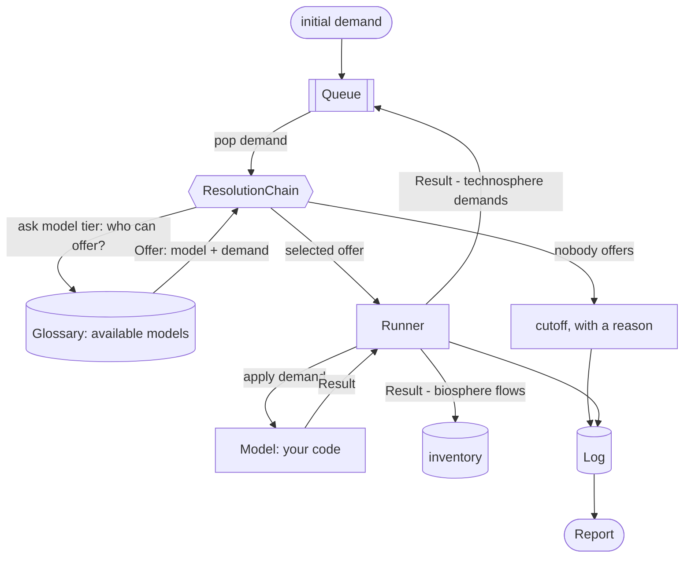

# sentier-trailrunner

`trailrunner` computes a life cycle inventory by orchestrating computational
models instead of static unit-process datasets.

A *model* stands for one process, most often Python code, and as readily a
plain measurement such as metered emissions for this process at this location
and time. Given a demand for one of its products it works out what other inputs
it needs to produce that, and what it emitted, reading its parameters from a
[trailpack](https://github.com/TimoDiepers/trailpack) parquet file rather than
hard-coding them.

Every flow crossing a model's boundary is an IRI from the hierarchical
[sentier vocabulary](https://vocab.sentier.dev), so the orchestrator can take a
model's further demands, work out which models produce them, and call those in
turn, cascading outward until nothing is left open.



## Documentation

- [The 5-minute tour](docs/showcase.md), one demand carried end to end with the
  real output at every step, built from [`examples/showcase.ipynb`](examples/showcase.ipynb)
- [Core Concepts](docs/content/concepts.md), the parts above one at a time
- [Quick Start](docs/content/getting_started/quickstart.md), a first calculation
- [Tutorial: an LCA from the CLI](docs/content/getting_started/cli.md), a supply
  chain, a score and a curve without writing Python
- [Writing a Model](docs/content/writing_a_model.md) · [Parameters](docs/content/parameters.md) · [Resolution](docs/content/resolution.md) · [Attribution](docs/content/attribution.md) · [Reading a Report](docs/content/reports.md) · [Assessment](docs/content/assessment.md) · [Figures](docs/content/figures.md)
- [`examples/coproduction.ipynb`](examples/coproduction.ipynb), what a run does
  when one model makes two things
- [`examples/dac.ipynb`](examples/dac.ipynb), the worked example end to end

## Status

Early development. Computes an inventory, plus static and time-explicit (dynamic)
impact characterization of it.

## Running from the shell

Demand one tonne of Portland cement (BONSAI `fi_37440`) in Denmark in 2030, using the
models that ship in `examples/`:

```bash
uv run trailrunner run \
    https://vocab.sentier.dev/products/bonsai/2025.1/BONSAI2025.1/fi_37440 \
    --amount 1000 --unit kg --location DK --year 2030 \
    --models examples/showcase_models.py \
    --context-tolerance pressure=0:1
```

It prints a summary (how many nodes ran, how many demands went unanswered and why, how
many were answered by a stand-in), then the supply chain as a tree, one line per demand:

```text
1000 kg fi_37440 @DK/2030  [model: CementPlant]
  2475 MJ fi_12020 @DK/2030 (pressure=4 bar)  [proxy: context: pressure 4 bar -> 5 bar]
    68.75 Nm3 natural-gas-at-production @NO/2030  [model: NaturalGasExtraction]
    ...
  1125 kg fi_15200 @DK/2030  [cutoff: no_model_found]
```

`@DK/2030` is where and when, `(pressure=4 bar)` is what the demand asked for beyond that,
and the brackets say who answered: an exact `model`, a `proxy` with what was conceded, or a
`cutoff` with the reason.

**`--context-tolerance`** is what turned the gas into a proxy. The kiln's burners ask for
gas at 4 bar; the only supplier delivers at 5. Matching is exact by default, so without
the flag that gas is a `coverage_excluded` cutoff. `pressure=0:1` reads *up to 0 bar
lower, up to 1 bar higher* than asked: higher-pressure gas can be throttled at the burner,
lower can't be boosted. The move is written into the tree and counted as a proxy.

| Flag | What it does |
| --- | --- |
| `IRI`, `--amount`, `--unit` | what to demand, and how much (required) |
| `--location`, `--year` | where and when; every model downstream receives them |
| `--models FILE` | a `.py` file defining a `MODELS` list (required) |
| `--context-tolerance NAME=BELOW:ABOVE` | let condition `NAME` be met up to `BELOW` lower / `ABOVE` higher, in its own unit; repeat per condition |
| `--proxy-order ORDER` | which conditions to relax, in order: `,` between tries, `+` to move conditions together, e.g. `context.pressure,context.pressure+context.temperature`; default is one condition at a time |
| `--method FILE` | characterize with a method parquet and print a score |
| `--dynamic METRIC`, `--horizon YEARS` | a time-explicit result, e.g. `radiative_forcing` |
| `--allocation`, `--capital` | the run's normative choices for co-products and capital goods |
| `--max-depth`, `--max-nodes` | bound the traversal |
| `--out FILE` | write the full run log to parquet |

The [CLI tutorial](docs/content/getting_started/cli.md) walks through each, including a
two-condition example of `--proxy-order`.

## Development

```bash
uv sync --extra dev
uv run pytest
```
