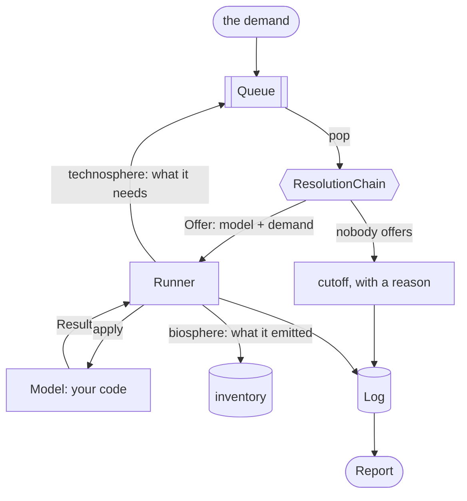

# sentier-trailrunner

Model-based supply chain traversal for life cycle inventories.

Installs as `sentier-trailrunner`, imports as `trailrunner`.

A life cycle inventory is usually a matrix of fixed coefficients: every process
linear, scale-free, and the same wherever and whenever it runs. `trailrunner`
computes one by *traversing* a supply chain of models instead — Python code, one
per process — so a process can depend on its demand, its location and its year,
and every flow keeps the date and place it happened at.

## How it works

A *model* is Python code for one process. It reads its parameters from a
[trailpack](https://github.com/TimoDiepers/trailpack) parquet file and answers
one question: *given this demand, what did I produce, what do I need, and what
did I emit?* Everything else is the loop around it: pop a demand, find someone
who can answer it, validate what came back, push what it needs onto the queue,
write it all down.



| Part | Its one job |
| --- | --- |
| `Demand` | an amount and a unit of a `Flow` — *what*, *where*, *when* |
| `Queue` | the demands still waiting; FIFO unless given a priority |
| `ResolutionChain` | who can answer this demand? The first tier that offers wins: a model, a generalised demand, a borrowed background dataset |
| `Model` | one process, as code: `apply(demand) -> Result` |
| `Runner` | applies the model and validates the `Result` against the demand |
| `Log` | append-only: every node, edge, cutoff, fallback and rule, out to one parquet file |

The seams are deliberate. The traversal never learns how a process works, and a
process never learns what else is in the supply chain: a model *returns*
demands rather than looking anything up, so it cannot reach into the graph and
does not know whether anyone will answer it. Characterization is a separate
reading of the finished inventory, not a step in the walk.

**The whole architecture in five minutes**, one demand carried end to end with
real output at every step: [`docs/showcase.md`](docs/showcase.md), built from
[`examples/showcase.ipynb`](examples/showcase.ipynb).

Design: `docs/superpowers/specs/2026-09-21-trailrunner-design.md`

## Status

Early development. Computes an inventory, plus static and time-explicit (dynamic)
impact characterization of it.

## Development

```bash
uv sync --extra dev
uv run pytest
```

## Writing a model

A model answers one demand. `apply` receives the **full** demanded amount, not
a unit demand, and must echo it back as production: the same flow, the same
unit, and an amount that covers what was asked. Nothing downstream rescales,
so a model that under-produces would silently shrink the inventory; the Runner
rejects it instead.

```python
from trailrunner import Demand, Exchange, Flow, Model, Result

HEAT = "https://vocab.sentier.dev/products/heat"
GAS = "https://vocab.sentier.dev/products/natural-gas"
CO2 = "https://vocab.sentier.dev/flows/co2-fossil"


class MyBoiler(Model):
    produces = (HEAT,)  # the product IRIs this model can make

    def apply(self, demand: Demand) -> Result:
        gas = demand.amount / 40.0  # kg of gas per MJ of heat, 90% efficient
        here = dict(location=demand.flow.location, time=demand.flow.time)
        return Result(
            # what I made: the demand, echoed back
            production=[Exchange(flow=demand.flow, amount=demand.amount, unit=demand.unit)],
            # what I need: pushed onto the queue and traversed in turn
            technosphere=[Demand(flow=Flow(iri=GAS, **here), amount=gas, unit="kg")],
            # what I emitted: accumulated into the inventory
            biosphere=[Exchange(flow=Flow(iri=CO2, **here), amount=2.75 * gas, unit="kg")],
        )
```

Optionally declare a `Coverage` to say where and when the model is valid, and
pass a `ParameterSet` at construction to read its numbers from a parquet file
instead of hard-coding them. A demand outside a model's coverage is reported
as an unresolved leaf with reason `coverage_excluded`, naming the model — so
remember to give the root `Flow` the `time` a time-bounded model expects.

## Example

```python
from trailrunner import Demand, Flow, Glossary, LocationHierarchy, Orchestrator, ParameterSet
from trailrunner.models.dac import CO2_CAPTURED, DirectAirCapture

params = ParameterSet.from_parquet(
    "dac_params.parquet",
    hierarchy=LocationHierarchy({"CH": "RER", "RER": "GLO"}),
)
glossary = Glossary([DirectAirCapture(params=params)])

report = Orchestrator(glossary).calculate(
    Demand(flow=Flow(iri=CO2_CAPTURED, location="CH", time=2030), amount=1000.0, unit="kg")
)

for (flow, unit), amount in report.inventory.items():
    print(f"{amount:>12.2f} {unit}  {flow.iri}")

for record in report.unresolved:
    print(f"unresolved: {record.demand.flow.iri} ({record.reason})")

print(report.tree())
```

A demand nobody models is reported as unresolved, never silently treated as
zero. Every parameter fallback used along the way shows up in
`report.provenance`.

## Scoring the inventory

Characterization is a separate reading of the inventory above, not a step the traversal
performs — see [`docs/content/assessment.md`](docs/content/assessment.md) for why:

```python
from trailrunner.assessment import Method, assess

assessment = assess(report, Method.from_parquet("gwp100.parquet"))
assessment.score            # total, in the method's declared unit
assessment.uncharacterized  # flows the method has no factor for — never silently zero
print(assessment.summary())  # the score, the method, and every reason to distrust it
```

`trailrunner` never writes a method parquet itself; convert one from an existing Brightway
LCIA method with `dev/convert_brightway_method.py` (behind the `brightway` extra), or write one
by hand in the layout `docs/content/assessment.md` describes.

[`examples/dac.ipynb`](examples/dac.ipynb) walks through this end to end with
explanation: writing the parameter parquet with trailpack, location fallback
and year interpolation, why the regeneration heat has to be code, the cutoff
leaves, and the coverage boundary. It needs the `examples` extra:

```bash
uv sync --extra dev --extra examples
uv run jupyter lab examples/dac.ipynb
```
