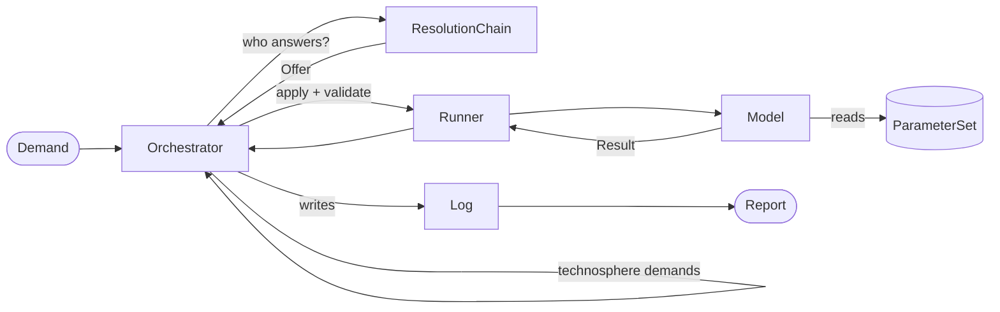

# Core Concepts

`trailrunner` is a handful of small parts, each with one job. The traversal never knows
how a process works, and a process never knows what else is in the supply chain.



## Flow, Exchange, Demand

A [`Flow`](../api/flow.md) is **identity**: what a thing is (`iri`), where it is
(`location`), and when it is (`time`, a year). It has no amount and no unit, so it is
hashable and serves directly as the inventory's aggregation key.

The `iri` is a concept in the [sentier vocabulary](https://vocab.sentier.dev), not a
free-text name. Two models written independently have to agree on identity before they
can connect at all. The vocabulary is hierarchical, so the same IRI also gives the concept's
name (`skos:prefLabel`, which [`Report.tree(labels=...)`](reports.md#summary-and-tree)
prints) and its broader parents (`skos:broader`, which the
[generalising tier](resolution.md#tier-2-generalising-a-demand) climbs).

`location` is an opaque key resolved through a [`LocationHierarchy`](../api/location.md)
(`CH → RER → GLO`), so regions and the globe can be expressed as well as countries. `None`
on either `location` or `time` means the flow isn't specific to a place or a year.

An [`Exchange`](../api/flow.md) is a quantified flow: the `amount` and `unit` live here. It
may also carry `properties` (mass, price, energy content) for
[allocation](attribution.md) to partition on.

A `Demand` is an alias of `Exchange`, not a subclass, so the two can't drift apart. It
means "a technosphere exchange somebody must satisfy".

```python
from trailrunner import Demand, Flow

flow = Flow(iri="https://vocab.sentier.dev/products/heat", location="CH", time=2030)
demand = Demand(flow=flow, amount=5000.0, unit="MJ")
```

## Model

A [`Model`](../api/model.md) stands for one process. Usually it is Python code, but it can
equally be a plain measurement, such as metered emissions for this plant in this year, read
from the same parquet file as any other parameter. A model:

- declares the product IRIs it `produces`,
- optionally restricts where and when it is valid with a [`Coverage`](../api/coverage.md),
- declares which allocation rules it `supports`,
- implements `apply(demand) -> Result`.

`apply` receives the **full** demand, never a unit demand, and nothing downstream rescales
the result. A plant at ten times the scale is not ten times the plant, and a model can say
so. See [Writing a Model](writing_a_model.md).

## Result

A [`Result`](../api/result.md) answers "given this demand, what happened?":

| Field | Meaning |
| --- | --- |
| `production` | what the model made. It must cover the demand that triggered the run |
| `technosphere` | upstream demands, pushed onto the queue and traversed in turn |
| `biosphere` | elementary flows, summed into the inventory |
| `provenance` | which parameter rows and fallbacks the model used |

## Glossary and ResolutionChain

The [`Glossary`](../api/glossary.md) indexes model instances by the product IRIs they
declare, filtered by coverage. For a flow it answers in one of three ways:

- no candidate → `None`, and the demand becomes a cutoff,
- exactly one → that model,
- two or more → [`AmbiguousModelMatch`](../api/errors.md). Two models producing the same
  flow is a data error for the practitioner to settle, not something to decide by silent
  precedence.

A [`ResolutionChain`](../api/resolution.md) is an ordered list of providers, and the first
offer wins. Tier 1 wraps the glossary (`ModelProvider`). Optional later tiers can relax the
demand (`GeneralisingProvider`) or borrow a dataset (`BackgroundProvider`), and each one
records the concession it made. Passing a bare `Glossary` to the `Orchestrator` is
shorthand for a one-tier chain. See [Resolution](resolution.md).

## Runner

The [`Runner`](../api/runner.md) applies the model and is the one place where a `Result`
is validated. The checks run in the order a model author wants to hear about them:

1. every exchange, in all three lists, carries a unit,
2. every production amount has the same sign as the demand,
3. the demanded product is among the production, in the demanded unit,
4. the summed production of that product **covers** the demanded amount.

Rule 4 is load-bearing. `apply` gets the full demand and nothing rescales afterwards, so
under-production would silently shrink the whole inventory. Producing more than demanded
is allowed. Rule 2 says "same sign" rather than "positive" because a
[substitution credit](attribution.md#who-may-answer-a-credit) is a negative demand, and it
is answered by negative production.

The Runner then applies the run's allocation rule to the validated result (see
[Attribution](attribution.md)). It is a separate object so that a concurrent
implementation could replace it without touching the orchestrator.

## Queue and Orchestrator

The [`Queue`](../api/queue.md) is FIFO by default, and a heap if given a priority
callable. No priority function ships: an inventory has no score to rank by, and MJ, kg and
kWh are not comparable.

The [`Orchestrator`](../api/orchestrator.md) is the loop: pop a demand, ask the chain, run
the offer, log it, push the technosphere demands back on. Every visit is its own node, and
nodes are never merged. A loop in the supply chain is therefore **bounded**, not solved:
by `max_depth` (default 10) and `max_nodes` (default 1000). A flow that repeats on its own
path is flagged as a warning, and `report.truncated` says when a limit was hit. A truncated
tree with an honest unresolved list is better than a converged number that would be wrong.

```python
from trailrunner import Orchestrator, Settings, AttributionSettings

orchestrator = Orchestrator(
    glossary,                        # or a ResolutionChain
    max_depth=10,
    max_nodes=1000,
    settings=Settings(attribution=AttributionSettings(allocation="economic")),
)
report = orchestrator.calculate(demand)
```

## Settings

[`Settings`](../api/settings.md) holds the run-wide configuration:

- `values`, an open dict a model can read keys from (`settings.get("scenario")`),
- `attribution`, an [`AttributionSettings`](attribution.md) with the run's allocation,
  capital and reuse rules,
- `proxy`, a [`ProxySettings`](resolution.md#tier-2-generalising-a-demand) that sets how far
  the generalising tier may relax a demand.

The two typed fields are closed: an unknown rule name raises when `Settings` is built, not
halfway through a run. Anything that varies per process belongs in that process's
`ParameterSet` instead.

## Log and Report

The [`Log`](../api/log.md) is the append-only record of what the traversal did: nodes,
edges, cutoffs, warnings, and each node's resolution and attribution. It writes to a single
parquet file under one explicit schema, so two runs can be compared with one read.

The [`Report`](../api/report.md) is the reading of that log a caller works with: the
aggregated `inventory`, the `unresolved` list, the per-node `provenance`, `resolutions`,
`proxies` and `attribution`, the traversal's `nodes` and `edges`, the `warnings`, and the
`truncated` flag. `summary()` and `tree()` render it as text. See
[Reading a Report](reports.md).

The inventory is the traversal's output, complete on its own. Characterization, whether a
static score or a time-explicit curve, is a separate reading of it done by
[`trailrunner.assessment`](assessment.md), not a step of the traversal.

## Errors vs. recorded data

The split is deliberate:

- **Data that can't be resolved** becomes a recorded cutoff: `no_model_found`,
  `coverage_excluded`, `generalisation_exhausted`, `max_depth`, `max_nodes`. The run
  continues and the report lists it.
- **A broken contract** raises, and the run stops:

| Error | Raised when |
| --- | --- |
| [`AmbiguousModelMatch`](../api/errors.md) | two models answer the same flow |
| [`ValidationError`](../api/errors.md) | a model's `Result` breaks a Runner rule |
| [`ParameterNotFound`](../api/errors.md) | no parameter row or fleet plant resolves anywhere on the location chain |
| [`MissingUnit`](../api/errors.md) | a unit is asked for and the parquet metadata doesn't declare one |
| [`MissingProperty`](../api/errors.md), [`UnsupportedAttribution`](../api/errors.md), [`UnallocatedCoProduction`](../api/errors.md) | the [allocation rule](attribution.md#when-a-model-cant-honour-the-rule) can't be applied |
| [`DuplicateBackgroundEntry`](../api/errors.md), [`DuplicateFactor`](../api/errors.md), [`MissingColumns`](../api/errors.md) | a background pack or method file is ambiguous or malformed on load |
| [`NoModelFound`](../api/errors.md) | a `Runner` is asked to apply a demand directly and no model exists |

All derive from `TrailrunnerError` and are importable from the package root:

```python
from trailrunner import TrailrunnerError, ValidationError, MissingUnit
```
