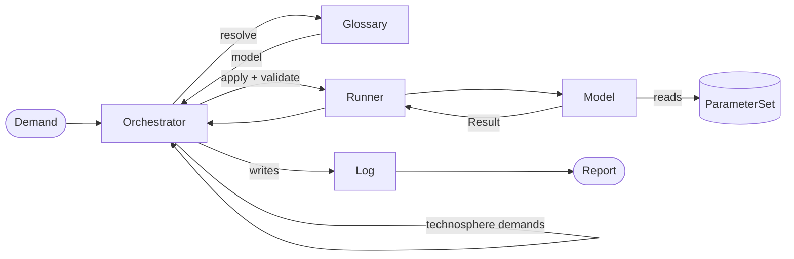

---
tags:
  - concepts
---

# Core Concepts

`trailrunner` has six moving parts. Each one has a single job, and the seams between them
are deliberate: the traversal never knows how a technology works, and a technology never
knows what else is in the supply chain.



## Flow, Exchange, Demand

A [`Flow`](../api/flow.md) is *identity*: what a thing is (`iri`), where it is (`location`)
and when it is (`time`). It carries no amount and no unit, which keeps it hashable and lets
it be used directly as an aggregation key in the inventory.

An [`Exchange`](../api/flow.md) is a quantified flow — the `amount` and the `unit` live
here, not on the `Flow`.

A `Demand` is an alias of `Exchange`, not a subclass, so the two cannot drift apart. It
means "a technosphere exchange somebody must satisfy".

```python
from trailrunner import Demand, Exchange, Flow

flow = Flow(iri="https://vocab.sentier.dev/products/heat", location="CH", time=2030)
demand = Demand(flow=flow, amount=5000.0, unit="MJ")
```

## Model

A [`Model`](../api/model.md) is Python code for one technology. It declares the product IRIs
it `produces`, optionally restricts its validity with a [`Coverage`](../api/coverage.md),
and implements `apply(demand) -> Result`.

`apply` receives the **full** demand amount, never a unit demand. This is the whole point:
a plant at ten times the scale is not ten times the plant, and nothing downstream rescales
the result.

## Result

A [`Result`](../api/result.md) answers "given this demand, what happened?":

| Field | Meaning |
| --- | --- |
| `production` | what the model made; must cover the demand that triggered the run |
| `technosphere` | upstream demands, pushed onto the traversal queue |
| `biosphere` | exchanges accumulated into the inventory |
| `provenance` | which parameter rows and fallbacks the model actually used |

## Glossary

The [`Glossary`](../api/glossary.md) indexes model *instances* by the product IRIs they
declare, and answers three ways:

- no candidate → `None`, and the caller records a cutoff leaf
- exactly one → that model
- two or more → [`AmbiguousProducer`](../api/errors.md); two models producing the same flow
  is a data error, not something to settle by silent precedence

## Runner

The [`Runner`](../api/runner.md) is the single place where a `Result` is validated. Four
rules, in the order a model author wants to hear about them:

1. every exchange carries a unit
2. production amounts are positive
3. the demanded product is among them, in the demanded unit
4. the summed production of that product **covers** the demanded amount

Rule 4 is load-bearing. Since `apply` gets the full demand and nothing rescales afterwards,
under-production would silently shrink the entire inventory. Over-production is allowed — a
process may legitimately make more than was asked of it.

It is a separate object so a concurrent implementation can replace it behind the same
interface without the orchestrator changing.

## Queue and Orchestrator

The [`Queue`](../api/queue.md) is FIFO by default, and a heap when given a priority
callable. No priority function ships with v1: with an inventory-only result there is no
score to rank by, and MJ, kg and kWh are not comparable.

The [`Orchestrator`](../api/orchestrator.md) walks demands outward. Every visit is its own
node; nodes are never merged. A loop is therefore *bounded*, by `max_depth` (default 10) and
`max_nodes` (default 1000), and flagged as a warning — not solved. A truncated tree with an
honest unresolved list beats a converged number that would be wrong. `report.truncated`
says when the limits bit.

## Log and Report

The [`Log`](../api/log.md) is the append-only record of everything the traversal did: nodes,
edges, cutoff leaves, warnings. It can be written to a single parquet file under one
explicit schema, so two runs can be diffed with a single read.

The [`Report`](../api/report.md) reads the graph back out of the log and presents the
aggregated `inventory`, the `unresolved` list, the `provenance` per node, the `nodes` and
`edges` of the traversal, the `warnings`, and the `truncated` flag.

v1 stops at the inventory: no characterization, so no single score. The unresolved list and
the provenance table are as much a part of the answer as the numbers.

## Errors vs. recorded data

The split is deliberate:

- **Unresolvable data** becomes a recorded leaf in the log — `no_producer`,
  `coverage_excluded`, `max_depth`, `max_nodes`.
- **Unresolvable contracts** raise: [`AmbiguousProducer`](../api/errors.md),
  [`ValidationError`](../api/errors.md), [`ParameterNotFound`](../api/errors.md),
  [`MissingUnit`](../api/errors.md), and [`NoProducer`](../api/errors.md) when a model is
  asked for directly.

`Orchestrator.calculate` propagates these straight to the caller, so they are importable
from the package root alongside the types:

```python
from trailrunner import MissingUnit, TrailrunnerError, ValidationError
```
