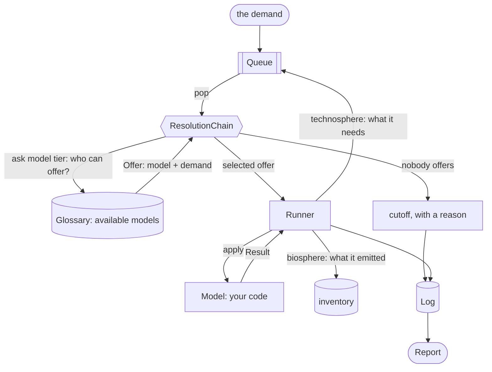

# Supply chains as code with `trailrunner`

**`trailrunner` lets a process be Python code instead of a fixed row of coefficients.** A *model* reads its parameters from a [trailpack](https://github.com/TimoDiepers/trailpack) parquet file and answers one question: *given this demand, what did I produce, what do I need, and what did I emit?* The orchestrator walks the resulting demands outward through the supply chain and accumulates an inventory.

## 🧱 The problem

A classic life cycle inventory is a matrix of fixed coefficients: every process linear and scale-free, and the numbers the same wherever and whenever it runs. Real processes are not. A direct air capture plant needs more regeneration heat in cold, dry air, because less CO2 and less water reach the sorbent per unit of air moved. That dependency cannot live in a coefficient — it has to live in code, which means the calculation has to *run* the supply chain rather than invert it.

## ⚙️ How it works

One demand goes in. Six objects pass it around until the queue is empty.

| Part | Its one job |
| --- | --- |
| [`Demand`](api/flow.md) | an amount and a unit of a `Flow` — *what*, *where*, *when* |
| [`Queue`](api/queue.md) | the demands still waiting; FIFO unless you hand it a priority |
| [`ResolutionChain`](api/resolution.md) | who can answer this demand? It asks each tier in order; tier 1 is the [`Glossary`](api/glossary.md), which offers a `(model, demand)` pair to run. If no tier offers, the demand is logged as a cutoff |
| [`Model`](api/model.md) | one process, as code: `apply(demand) -> Result` |
| [`Runner`](api/runner.md) | applies the model and validates the [`Result`](api/result.md) against the demand |
| [`Log`](api/log.md) | append-only: every node, edge, cutoff, fallback and rule, out to one parquet file |

**You bring** a [`Model`](api/model.md) per process:

- it declares the product IRIs it `produces`, and optionally a [`Coverage`](api/coverage.md) restricting where and when it is valid
- its `apply(demand)` receives the **full** demand amount, never a unit demand, so nonlinear behaviour survives
- it returns a [`Result`](api/result.md): what it produced, which upstream demands it needs, and what it emitted

**You get** a [`Report`](api/report.md): an aggregated biosphere inventory, an explicit list of everything that stayed *unresolved*, which tier answered each node, and the provenance of every parameter fallback taken along the way.

The seams are deliberate. The traversal never learns how a process works, and a process never learns what else is in the supply chain: a model *returns* demands rather than looking anything up, so it cannot reach into the graph and does not know whether anyone will answer it. And because a [`Flow`](api/flow.md) carries its year the way it carries its location, the inventory comes out dated without any step of the walk knowing about time.

[The 5-minute tour](showcase.md) carries one demand through all of that, with the real output at every step.

## 🧭 Design commitments

- **A demand nobody models is reported, never silently treated as zero.** Cutoffs are data in the report, not gaps in the number.
- **Nothing is substituted silently.** A location fallback `CH → RER → GLO`, an interpolated year or a generalised product shows up in `report.provenance` or `report.proxies`.
- **Two models producing the same flow is an error**, not something to resolve by precedence.
- **Loops are truncated, not converged.** Every visit is its own node; `max_depth` and `max_nodes` bound the walk and `report.truncated` says when they bit.
- **Value judgements are the practitioner's.** A co-producing model will not run until the study states an allocation rule, and the rule it ran under is on the report.

## 👩‍💻 Getting started

- [Installation](content/installation.md)
- [The 5-minute tour](showcase.md)
- [Quick Start](content/getting_started/quickstart.md)
- [Core Concepts](content/concepts.md)
- [Writing a Model](content/writing_a_model.md)
- [API Reference](api/index.md)

## 🚧 Status

Early development. The traversal produces an inventory; [`trailrunner.assessment`](content/assessment.md) is a separate reading of it that turns the inventory into a static score or a time-explicit curve.
