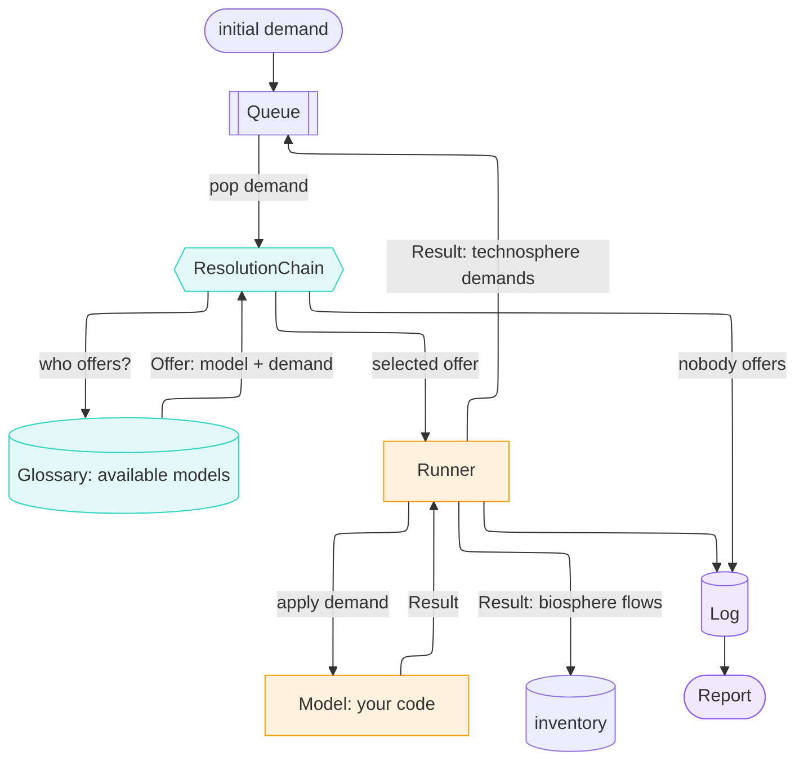

# Supply chains as models calling models

`trailrunner` computes a life cycle inventory by orchestrating computational models instead of static unit-process datasets.

## 💡 The idea

Treat a physical activity as a computational *model* instead of a static unit process dataset. Given a demand for one of its products, it works out what other inputs it needs to produce that, and what it emitted. Model parameters are fetched from a [trailpack](https://github.com/TimoDiepers/trailpack) parquet file depending on context, e.g., place, time, specifications. A model can just as well be a plain measurement, such as metered emissions for this process at this location and time.

Every flow that crosses a model's boundary is identified by an IRI from the hierarchical [sentier vocabulary](https://vocab.sentier.dev). This allows an orchestrator to identify which model can fulfil which demand and call them in turn, cascading outward from an initial demand through the whole supply chain until all inputs are provided and a full list of environmental flows is recorded:

*Legend: resolution (teal), execution (amber), record (violet).*

| Part | Its one job |
| --- | --- |
| [`Demand`](api/flow.md) | an amount and a unit of a `Flow`, which carries what, where and when |
| [`Orchestrator`](api/orchestrator.md) | owns the queue and is the loop itself — `while queue:`, pop, ask, apply, log, push what came back |
| [`Queue`](api/queue.md) | the demands still waiting. FIFO unless you hand it a priority |
| [`ResolutionChain`](api/resolution.md) | who can answer this demand? It asks each tier in order. Tier 1 is the [`Glossary`](api/glossary.md), which offers a `(model, demand)` pair to run. A demand no tier offers for is logged as a cutoff |
| [`Model`](api/model.md) | one process, as code. `apply(demand) -> Result` |
| [`Runner`](api/runner.md) | applies the model and validates the [`Result`](api/result.md) against the demand |
| [`Log`](api/log.md) | append-only. Every node, edge, cutoff, fallback and rule, written out to one parquet file |

**You bring** a [`Model`](api/model.md) per process:

- it declares the product IRIs it `produces`, and optionally a [`Coverage`](api/coverage.md) restricting where and when it is valid
- its `apply(demand)` receives the full demanded amount, the whole thing that was asked for, so nonlinear behaviour survives
- it returns a [`Result`](api/result.md) holding what it produced, which upstream demands it needs, and what it emitted

**You get** a [`Report`](api/report.md) holding an aggregated biosphere inventory, an explicit list of everything that stayed *unresolved*, which tier answered each node, and the provenance of every parameter fallback taken along the way.

An IRI in place of a free-text name is what lets two people's models meet at all, and it keeps paying after the match. The same concept carries its own `skos:prefLabel`, the name [`Report.tree()`](api/report.md) prints when given one, and its `skos:broader` parent, the ladder the [generalising tier](content/resolution.md) climbs when nobody produces the exact concept asked for.

The seams are deliberate. The traversal never learns how a process works, and a process never learns what else is in the supply chain. A model *returns* demands, so it cannot reach into the graph, and it has no way of knowing whether anyone will answer. And because a [`Flow`](api/flow.md) carries its year the way it carries its location, the inventory comes out dated without any step of the walk knowing about time.

[The 5-minute tour](showcase.md) carries one demand through all of that, with the real output at every step.

## 🧭 Design commitments

- **A demand nobody models is reported.** Cutoffs are data in the report, each with a reason and a place in the chain, so a reader can see what the number leaves out.
- **Every substitution is recorded.** A location fallback `CH → RER → GLO`, an interpolated year or a generalised product shows up in `report.provenance` or `report.proxies`.
- **Two models producing the same flow raises.** Precedence between them is a data question for the practitioner to settle.
- **Loops are bounded.** Every visit is its own node; `max_depth` and `max_nodes` bound the walk, and `report.truncated` says when they bit.
- **Value judgements are the practitioner's.** A co-producing model runs once the study states an allocation rule, and the rule it ran under is on the report.

## 👩‍💻 Getting started

- [Installation](content/installation.md)
- [The 5-minute tour](showcase.md)
- [Quick Start](content/getting_started/quickstart.md), a first calculation in Python
- [Tutorial: an LCA from the CLI](content/getting_started/cli.md), a supply chain, a score and a curve from the shell
- [Core Concepts](content/concepts.md)
- [Writing a Model](content/writing_a_model.md)
- Worked examples: [Co-production and allocation](content/examples/coproduction.md) · [Direct air capture, end to end](content/examples/dac.md)
- [API Reference](api/index.md)

## 🚧 Status

Early development. The traversal produces an inventory. [`trailrunner.assessment`](content/assessment.md) is a separate reading of it that turns the inventory into a static score or a time-explicit curve, and [`trailrunner.viz`](content/figures.md) draws either.
