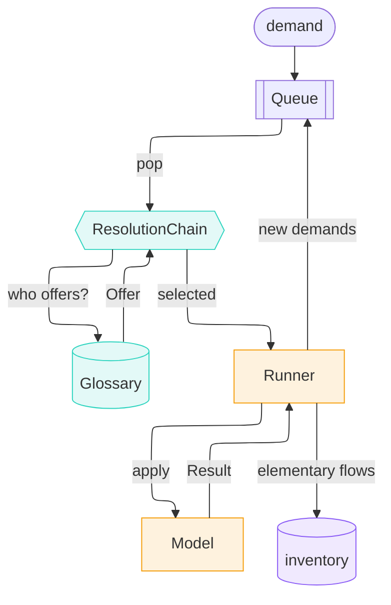
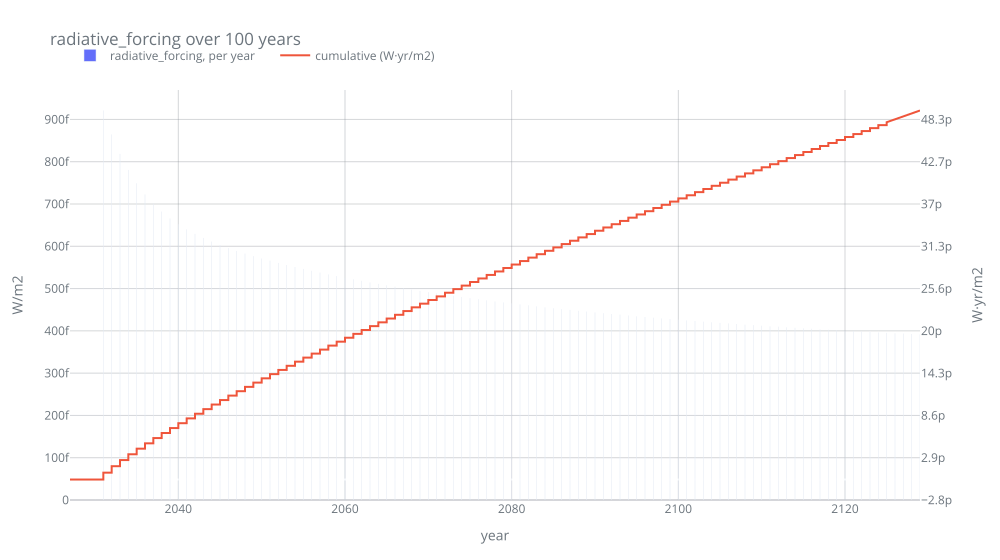

---
tags:
  - tutorial
---

# The pitch (5 min)

**1000 kg Portland cement, Denmark, 2030 — what's the impact?**

`trailrunner`: computational process models, not static unit processes.

*Shorter version: [3-minute pitch](pitch.md).*

---

## Models instead of unit processes

```python
answer = cement_model.apply(DEMAND)
```

```text
   production    1000.0 kg   Portland cement, aluminous cement, slag cem… @DK/2030
 technosphere    1125.0 kg   Gypsum; anhydrite; limestone flux; limeston… @DK/2030
 technosphere    2475.0 MJ   Natural gas, liquefied or in the gaseous st… @DK/2030
 technosphere      10.0 kg   Quicklime, slaked lime and hydraulic lime    @DK/2030
 technosphere     100.0 kWh  electricity                                  @DK/2030
    biosphere     397.5 kg   co2-fossil                                   @DK/2030
    biosphere     138.6 kg   co2-fossil                                   @DK/2030
```

- Takes a `Demand`, returns a `Result`: made, needed, emitted
- Names = concepts from the [sentier vocabulary](https://vocab.sentier.dev) — shared, so two models can compose with no name matching
- Physics-aware: process can react to *where* and *when* it's asked

```python
row = params.at(location="DK", time=2030)
penalty = moisture_penalty(row["moisture"], row["temperature"])
fuel = row["fuel_demand"] * clinker * penalty
```

```text
 where   when  moisture   degC   penalty   gas [MJ]
    DK   2030     0.040   10.0     1.000     2475.0
   RER   2030     0.060    9.0     1.044     2923.2
```

!!! info "trailpack"
    Params from [`trailpack`](https://github.com/TimoDiepers/trailpack) parquet — units & vocab IRIs embedded per column. BrightCon 2025 hackathon project.

**Measured beats modelled, when it exists.** Same product, disjoint
coverage — year on the demand picks meter vs. model:

```text
2023  answered by MeteredCementPlant
      source: measured
      direct CO2:  562.0 kg in 1 exchange(s)
           562.0 kg
2030  answered by CementPlant
      source: modelled
      direct CO2:  536.1 kg in 2 exchange(s)
           397.5 kg
           138.6 kg
```

Meter sees one plume. Model knows which kg came from where.

---

## Orchestrating multiple models



`Orchestrator.calculate` = `while queue:`, little else. Same IRI in
`produces` → found; everything else logged as a cutoff with a reason:

Pop a demand, ask who can answer it, push what comes back:

```text
pop      1000 kg   Portland cement, aluminous ceme… -> CementPlant
pop      1125 kg   Gypsum; anhydrite; limestone fl… -> cutoff (nobody offered)
pop      2475 MJ   Natural gas, liquefied or in th… -> NaturalGasSupply
pop        10 kg   Quicklime, slaked lime and hydr… -> cutoff (nobody offered)
pop       100 kWh  electricity                      -> GridElectricity
pop     68.75 Nm3  natural-gas-at-production        -> NaturalGasExtraction
pop     50.53 tkm  natural-gas-transport-offshore-… -> NaturalGasOffshorePipelineTransport
pop     8.466 kWh  electricity-natural-gas          -> GasPower
pop     84.66 kWh  electricity-wind                 -> cutoff (nobody offered)
pop      12.7 kWh  electricity-hydro                -> cutoff (nobody offered)
pop 8.995e-08 unit pipeline-natural-gas-long-dista… -> cutoff (nobody offered)
pop   0.01306 Nm3  natural-gas-at-production        -> NaturalGasExtraction
pop     16.54 MJ   natural-gas-burned-in-gas-turbi… -> cutoff (nobody offered)
pop 5.862e-06 tkm  transport-freight-lorry-16t-32t  -> cutoff (nobody offered)
pop 5.862e-05 kg   disposal-used-mineral-oil-10-pe… -> cutoff (nobody offered)
pop     49.16 MJ   Natural gas, liquefied or in th… -> NaturalGasSupply
pop     1.365 Nm3  natural-gas-at-production        -> NaturalGasExtraction
pop     1.004 tkm  natural-gas-transport-offshore-… -> NaturalGasOffshorePipelineTransport
pop 1.786e-09 unit pipeline-natural-gas-long-dista… -> cutoff (nobody offered)
pop 0.0002594 Nm3  natural-gas-at-production        -> NaturalGasExtraction
pop    0.3285 MJ   natural-gas-burned-in-gas-turbi… -> cutoff (nobody offered)
pop 1.164e-07 tkm  transport-freight-lorry-16t-32t  -> cutoff (nobody offered)
pop 1.164e-06 kg   disposal-used-mineral-oil-10-pe… -> cutoff (nobody offered)
```

The graph that walk leaves behind:

```text
1000 kg Portland cement, aluminous cement, slag cement and similar hydraulic cements, except in the form of clinkers @DK/2030  [model: CementPlant]
  2475 MJ Natural gas, liquefied or in the gaseous state @DK/2030  [model: NaturalGasSupply]
    68.75 Nm3 natural-gas-at-production @NO/2030  [model: NaturalGasExtraction]
    50.5312 tkm natural-gas-transport-offshore-pipeline-long-distance @NO/2030  [model: NaturalGasOffshorePipelineTransport]
      0.0130625 Nm3 natural-gas-at-production @NO/2030  [model: NaturalGasExtraction]
      8.99456e-08 unit pipeline-natural-gas-long-distance-high-capacity-offshore @NO/2030  [cutoff: no_model_found]
      16.5404 MJ natural-gas-burned-in-gas-turbine @NO/2030  [cutoff: no_model_found]
      5.86162e-06 tkm transport-freight-lorry-16t-32t @NO/2030  [cutoff: no_model_found]
      5.86162e-05 kg disposal-used-mineral-oil-10-percent-water-hazardous-waste-incineration @NO/2030  [cutoff: no_model_found]
  100 kWh electricity @DK/2030  [model: GridElectricity]
    8.46561 kWh electricity-natural-gas @DK/2030  [model: GasPower]
      49.1551 MJ Natural gas, liquefied or in the gaseous state @DK/2030  [model: NaturalGasSupply]
        1.36542 Nm3 natural-gas-at-production @NO/2030  [model: NaturalGasExtraction]
        1.00358 tkm natural-gas-transport-offshore-pipeline-long-distance @NO/2030  [model: NaturalGasOffshorePipelineTransport]
          0.00025943 Nm3 natural-gas-at-production @NO/2030  [model: NaturalGasExtraction]
          1.78638e-09 unit pipeline-natural-gas-long-distance-high-capacity-offshore @NO/2030  [cutoff: no_model_found]
          0.328503 MJ natural-gas-burned-in-gas-turbine @NO/2030  [cutoff: no_model_found]
          1.16416e-07 tkm transport-freight-lorry-16t-32t @NO/2030  [cutoff: no_model_found]
          1.16416e-06 kg disposal-used-mineral-oil-10-percent-water-hazardous-waste-incineration @NO/2030  [cutoff: no_model_found]
    84.6561 kWh electricity-wind @DK/2030  [cutoff: no_model_found]
    12.6984 kWh electricity-hydro @DK/2030  [cutoff: no_model_found]
  1125 kg Gypsum; anhydrite; limestone flux; limestone and other calcareous stone, of a kind used for the manufacture of lime or cement @DK/2030  [cutoff: no_model_found]
  10 kg Quicklime, slaked lime and hydraulic lime @DK/2030  [cutoff: no_model_found]
```

Nobody wired that gas chain. The kiln asked for MJ; supply converted them to
wellhead Nm3 and route tkm and placed both **at the origin**, so the pipeline
model priced the leg on the Norwegian shelf, at its low-leakage tier.

!!! info "Where the pipeline model comes from"
    Reverse-engineered from BAFU-2026 ecoinvent EcoSpold data and the Bussa et al. 2025 LCI report — not invented.

---

## Finding fallback models

Tier 1 = models. Every later tier = **concession**, written at the node.
That last cutoff — 10 kg of lime — retried:

```text
       model: BinderSupply
 relaxations: ['product: fi_37420 -> fi_374']
       asked: Quicklime, slaked lime and hydraulic lime
    answered: Plaster, lime and cement
        tier: generalising
```

"Plaster, lime **and cement**" — contains the very product this plant
makes. Best available, poor in substance. Not hidden.

**Tier 3 borrows a dataset** (kiln construction), tags it honestly:

```text
  8.33 kg/year cement-kiln @DK/2026   [model: CementKilnConstruction]
    0.1 kg steel-low-alloyed @DK/2026 [background: unit_process, incomplete]
```

Run tallies its own gaps:

```text
18 nodes, 13 inventory entries
11 unresolved (generalisation_exhausted: 11)
5 proxies (4 incomplete)
attribution: allocation=none, capital=per_output
```

`capital=per_output` — normative choice, stated next to the numbers.

---

## Tracing time and place for free

`Flow` carries its year like it carries its location. Inventory = time series:

```python
dynamic = assess_dynamic(report, metric="radiative_forcing", horizon=100)
```



- Kilns (2027/2029): barely register
- 2031 cement production: 4 orders of magnitude bigger
- No matrix rebuilt, no second model — dates were never lost

---

## Why we want this

- **Supply chain assembles itself** — vocabulary IRIs, not wiring
- **Missing data is visible** — every cutoff carries a reason and a position
- **Concessions are declared and recorded** — not buried in an assumption
- **Inventories are time-explicit by construction** — dynamic LCIA needs no second model
- **The run is a file** — one parquet holds the graph, the gaps and the choices
- **A process can depend on its demand** — location, year, scale, feed conditions live in the model
- **A model can be a measurement** — same interface, disjoint coverage, report says which answered

---

*Shorter cut: [3-minute pitch](pitch.md) · Full tour: [showcase.md](showcase.md) ·
Notebook: [`examples/showcase.ipynb`](https://github.com/TimoDiepers/trailrunner/blob/main/examples/showcase.ipynb)*
