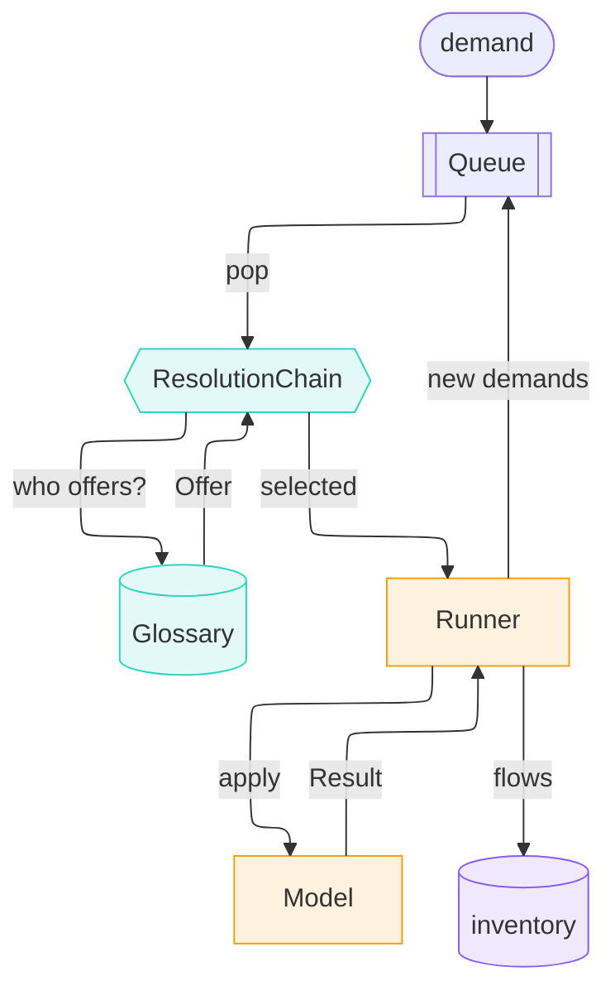

---
tags:
  - tutorial
---

# The pitch (3 min)

**1000 kg Portland cement, Denmark, 2030 — what's the impact?**

`trailrunner`: computational process models, not static unit processes.

*More detail: [5-minute pitch](pitch-5min.md).*

---

## A model is one method

```python
answer = cement_model.apply(DEMAND)
```

```text
   production    1000.0 kg   Portland cement, aluminous cement, slag cem… @DK/2030
 technosphere    1125.0 kg   Gypsum; anhydrite; limestone flux; limeston… @DK/2030
 technosphere    2475.0 MJ   Natural gas, liquefied or in the gaseous st… @DK/2030
    biosphere     397.5 kg   co2-fossil                                   @DK/2030
    biosphere     138.6 kg   co2-fossil                                   @DK/2030
```

- Takes a `Demand`, returns a `Result`: made, needed, emitted
- Names = concepts from the [sentier vocabulary](https://vocab.sentier.dev)
- Physics-aware: fuel demand reacts to moisture & temperature

```python
penalty = moisture_penalty(row["moisture"], row["temperature"])
fuel = row["fuel_demand"] * clinker * penalty
```

**Measured beats modelled, when it exists.** Same product, disjoint coverage
— demand's year picks meter vs. model.

```text
2023  answered by MeteredCementPlant   source: measured    562.0 kg CO2
2030  answered by CementPlant          source: modelled     536.1 kg CO2 (2 flows, not 1)
```

---

## Models find each other — no wiring



Same vocabulary IRI in `produces` = found. No name matching, no unit
guessing — that's what lets two models written by two different people
compose at all.

```text
1000 kg Portland cement …                [model: CementPlant]
  100 kWh electricity                     [model: GridElectricity]
    8.47 kWh electricity-natural-gas       [model: GasPower]
      49.16 MJ Natural gas …               [cutoff: no_model_found]
  1125 kg Gypsum; limestone flux; …       [cutoff: no_model_found]
```

Two hits, three cutoffs — every miss stays in the report, with a reason.

---

## Nothing answers? Relax along the vocabulary — deliberately

```text
       model: BinderSupply
 relaxations: ['product: fi_37420 -> fi_374']
       asked: Quicklime, slaked lime and hydraulic lime
    answered: Plaster, lime and cement   (broader concept, 2 hops up)
```

That answer is an average containing the very product this plant makes —
best available, poor in substance. **Written at the node, not silently
swallowed.** Every tier is a concession, and the tier that made it says so.

---

## Time rides along, for free

```python
dynamic = assess_dynamic(report, metric="radiative_forcing", horizon=100)
```


No matrix rebuilt, no second model. Dates were never lost.

---

## Why it matters

- Supply chain **assembles itself** — vocabulary, not wiring
- Missing data is **visible**, not silently zero
- Concessions are **declared and recorded**, not buried
- Inventories are **time-explicit by construction**
- A process can **depend on its own demand** (location, year, conditions)
- A model can **be a measurement** — same interface, disjoint coverage

---

*More detail: [5-minute pitch](pitch-5min.md) · Full tour: [showcase.md](showcase.md) ·
Notebook: [`examples/showcase.ipynb`](https://github.com/TimoDiepers/trailrunner/blob/main/examples/showcase.ipynb)*
