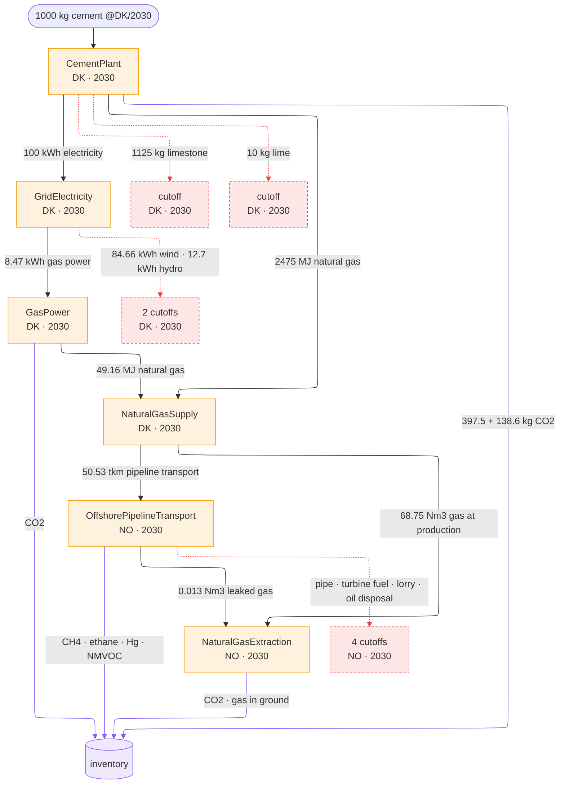

---
tags:
  - tutorial
---

# The pitch (3 min)

**1000 kg Portland cement, Denmark, 2030 — what's the impact?**

`trailrunner`: computational process models, not static unit processes.

*More detail: [5-minute pitch](pitch-5min.md).*

---

## Models instead of unit processes

```python
answer = cement_model.apply(DEMAND)
```

```text
                 amount unit flow                                         where  when
   production    1000.0 kg   Portland cement, aluminous cement, slag cem… DK     2030
 technosphere    1125.0 kg   Gypsum; anhydrite; limestone flux; limeston… DK     2030
 technosphere    2475.0 MJ   Natural gas, liquefied or in the gaseous st… DK     2030
 technosphere      10.0 kg   Quicklime, slaked lime and hydraulic lime    DK     2030
 technosphere     100.0 kWh  electricity                                  DK     2030
    biosphere     397.5 kg   co2-fossil                                   DK     2030
    biosphere     138.6 kg   co2-fossil                                   DK     2030
```

- Takes a `Demand`, returns a `Result`: made, needed, emitted
- Names = concepts from the [sentier vocabulary](https://vocab.sentier.dev)
- Physics-aware: fuel demand reacts to moisture & temperature

```python
row = params.at(location="DK", time=2030)
penalty = moisture_penalty(row["moisture"], row["temperature"])
fuel = row["fuel_demand"] * clinker * penalty
```

!!! info "trailpack"
    Params from [`trailpack`](https://github.com/TimoDiepers/trailpack) parquet — units & vocab IRIs embedded per column. BrightCon 2025 hackathon project.

**Measured beats modelled, when it exists.** Same product, disjoint coverage
— demand's year picks meter vs. model.

```text
2023  answered by MeteredCementPlant   source: measured    562.0 kg CO2
2030  answered by CementPlant          source: modelled     536.1 kg CO2 (2 flows, not 1)
```

---

## Orchestrating multiple models


Same vocabulary IRI in `produces` = found. No name matching, no unit
guessing — that's what lets two models written by two different people
compose at all.

One `while queue:` later:

```text
1000 kg Portland cement, aluminous cement, slag cement and similar hydraulic cements, except in the form of clinkers @DK/2030  [model: CementPlant]
  2475 MJ Natural gas, liquefied or in the gaseous state @DK/2030  [model: NaturalGasSupply]
    68.75 Nm3 natural-gas-at-production @NO/2030  [model: NaturalGasExtraction]
    50.5312 tkm natural-gas-transport-offshore-pipeline-long-distance @NO/2030  [model: NaturalGasOffshorePipelineTransport]
      0.0130625 Nm3 natural-gas-at-production @NO/2030  [model: NaturalGasExtraction]
      8.99456e-08 unit pipeline-natural-gas-long-distance-high-capacity-offshore @NO/2030  [cutoff: no_model_found]
      16.5404 MJ natural-gas-burned-in-gas-turbine @NO/2030  [cutoff: no_model_found]
      5.86162e-06 tkm transport-freight-lorry-16t-32t @NO/2030  [cutoff: no_model_found]
      5.86162e-05 kg disposal-used-mineral-oil-10-percent-water-hazardous-waste-incineration @NO/2030  [cutoff: no_model_found]
  100 kWh electricity @DK/2030  [model: GridElectricity]
    8.46561 kWh electricity-natural-gas @DK/2030  [model: GasPower]
      49.1551 MJ Natural gas, liquefied or in the gaseous state @DK/2030  [model: NaturalGasSupply]
        1.36542 Nm3 natural-gas-at-production @NO/2030  [model: NaturalGasExtraction]
        1.00358 tkm natural-gas-transport-offshore-pipeline-long-distance @NO/2030  [model: NaturalGasOffshorePipelineTransport]
          0.00025943 Nm3 natural-gas-at-production @NO/2030  [model: NaturalGasExtraction]
          1.78638e-09 unit pipeline-natural-gas-long-distance-high-capacity-offshore @NO/2030  [cutoff: no_model_found]
          0.328503 MJ natural-gas-burned-in-gas-turbine @NO/2030  [cutoff: no_model_found]
          1.16416e-07 tkm transport-freight-lorry-16t-32t @NO/2030  [cutoff: no_model_found]
          1.16416e-06 kg disposal-used-mineral-oil-10-percent-water-hazardous-waste-incineration @NO/2030  [cutoff: no_model_found]
    84.6561 kWh electricity-wind @DK/2030  [cutoff: no_model_found]
    12.6984 kWh electricity-hydro @DK/2030  [cutoff: no_model_found]
  1125 kg Gypsum; anhydrite; limestone flux; limestone and other calcareous stone, of a kind used for the manufacture of lime or cement @DK/2030  [cutoff: no_model_found]
  10 kg Quicklime, slaked lime and hydraulic lime @DK/2030  [cutoff: no_model_found]
```

The same walk, drawn — processes, the flows between them, and where each one
ended:



*Black arrows are demands answered by a model, dashed red ones are cutoffs,
violet ones are elementary flows.*

Nobody wired that gas chain up. Every miss stays in the report, with a reason.

!!! info "Where the pipeline model comes from"
    Reverse-engineered from BAFU-2026 ecoinvent EcoSpold data and the Bussa et al. 2025 LCI report — not invented.

---

## Finding fallback models

That last cutoff — 10 kg of lime — retried:

```text
       model: BinderSupply
 relaxations: ['product: fi_37420 -> fi_374']
       asked: Quicklime, slaked lime and hydraulic lime
    answered: Plaster, lime and cement   (broader concept, 2 hops up)
```

That answer is an average containing the very product this plant makes —
best available, poor in substance. **Written at the node, not silently
swallowed.** Every tier is a concession, and the tier that made it says so.

---

## Tracing time and place for free

```python
dynamic = assess_dynamic(report, metric="radiative_forcing", horizon=100)
```


No matrix rebuilt, no second model. Dates were never lost.

---

## Why we want this

- Supply chain **assembles itself** — vocabulary, not wiring
- Missing data is **visible**, not silently zero
- Concessions are **declared and recorded**, not buried
- Inventories are **time-explicit by construction**
- A process can **depend on its own demand** (location, year, conditions)
- A model can **be a measurement** — same interface, disjoint coverage

---

*More detail: [5-minute pitch](pitch-5min.md) · Full tour: [showcase.md](showcase.md) ·
Notebook: [`examples/showcase.ipynb`](https://github.com/TimoDiepers/trailrunner/blob/main/examples/showcase.ipynb)*
