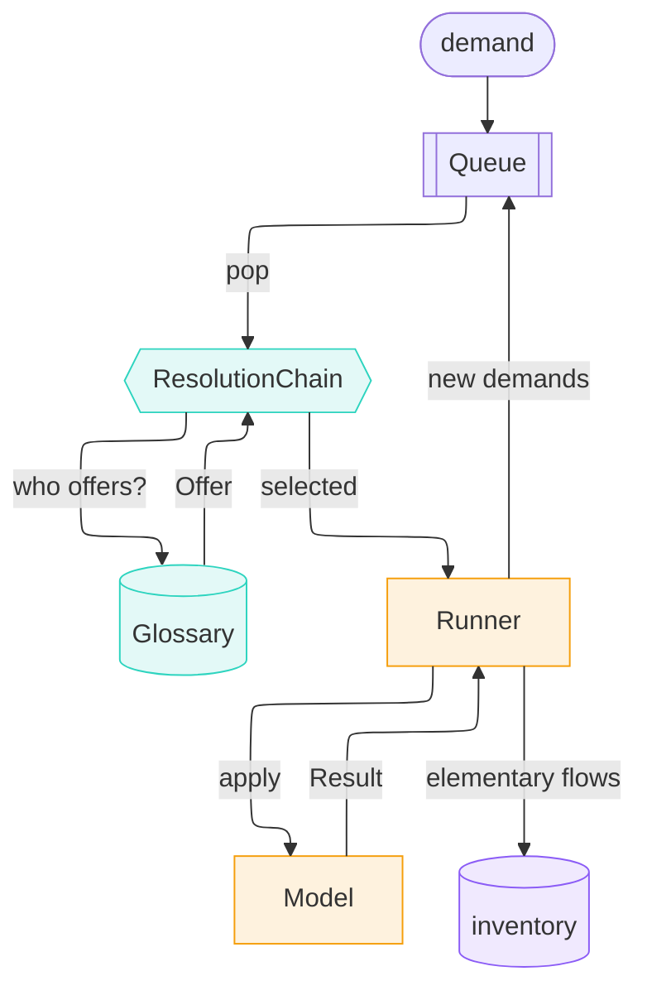
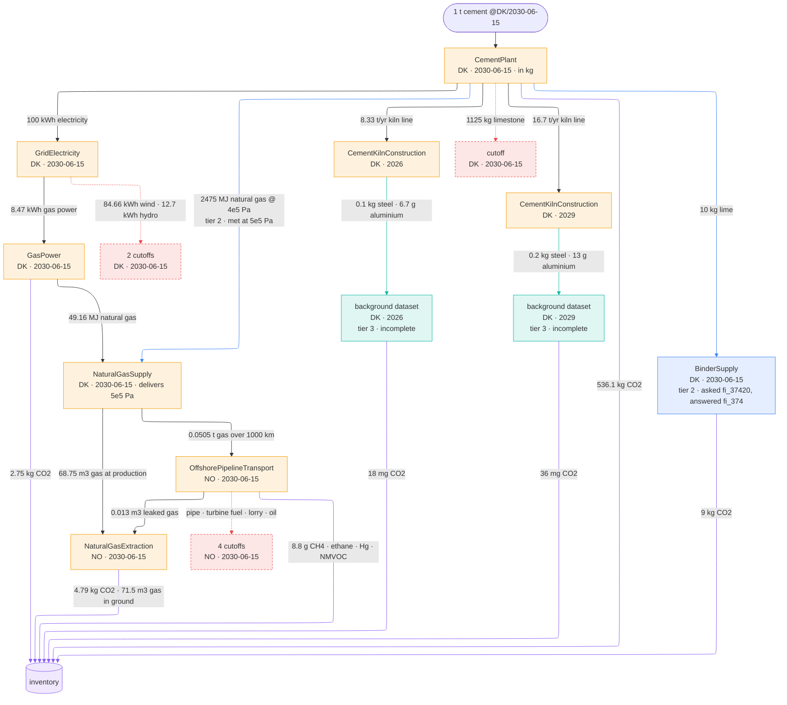

# The pitch (3 min)

**1 t Portland cement, Denmark, 15 June 2030 — what's the impact?**

`trailrunner`: computational process models, not static unit processes.

*More detail: [5-minute pitch](pitch-5min.md).*

---

## Models instead of unit processes

```python
# called directly, a model gets exactly what it is handed: kilograms
answer = cement_model.apply(Demand(flow=DEMAND.flow, amount=1000.0, unit=KG))
```

```text
                 amount unit flow                                         where       when
   production    1000.0 kg   Portland cement, aluminous cement, slag cem… DK    2030-06-15
 technosphere    1125.0 kg   Gypsum; anhydrite; limestone flux; limeston… DK    2030-06-15
 technosphere    2475.0 MJ   Natural gas, liquefied or in the gaseous st… DK    2030-06-15
 technosphere      10.0 kg   Quicklime, slaked lime and hydraulic lime    DK    2030-06-15
 technosphere     100.0 kWh  electricity                                  DK    2030-06-15
    biosphere     397.5 kg   co2-fossil                                   DK    2030-06-15
    biosphere     138.6 kg   co2-fossil                                   DK    2030-06-15
```

- Takes a `Demand`, returns a `Result`: made, needed, emitted
- Names = concepts from the [sentier vocabulary](https://vocab.sentier.dev)
- Physics-aware: fuel demand reacts to moisture & temperature

```python
row = params.at(location="DK", **in_year(2030))
penalty = moisture_penalty(row["moisture"], row["temperature"])
fuel = row["fuel_demand"] * clinker * penalty
```

!!! info "trailpack"
    Params from [`trailpack`](https://github.com/TimoDiepers/trailpack) parquet — units & vocab IRIs embedded per column. BrightCon 2025 hackathon project.

**Measured beats modelled, when it exists.** Same product, disjoint coverage
— demand's year picks meter vs. model.

```text
2023  answered by MeteredCementPlant   source: measured    562.0 kg CO2
2030  answered by CementPlant          source: modelled     536.1 kg CO2 (2 flows, not 1)
```

---

## Orchestrating multiple models



`Orchestrator.calculate` = `while queue:`, little else. Pop a demand, ask who
can answer it, push what comes back, write everything down. A model is found
by the IRI it declares in `produces` — no wiring, no registry.

---

## A unit falls back exactly

The demand is **1 t** of cement on **15 June 2030**. `CementPlant` reasons in
kilograms and its parameters are per year:

```python
DEMAND = Demand(
    flow=Flow(iri=CEMENT, location="DK", time="2030-06-15", time_standard=DATE),
    amount=1.0,
    unit=TONNE,
)
```

```text
1 t Portland cement, aluminous cement, slag cement and similar hydraulic cements, except in the form of clinkers @DK/2030-06-15  [model: CementPlant; unit: t -> kg ×1000]
```

Same quantity, different unit: converted by the vocabulary's own multiplier,
logged on the node, and not counted as a concession. The day lies inside 2030,
so the yearly parameters answer it.

---

## Finding fallback models

Tier 1 = models. Every later tier = **concession**, written at the node.

**Tier 2 generalises** one `skos:broader` step at a time:

```text
       model: BinderSupply
 relaxations: ['product: fi_37420 -> fi_374']
       asked: Quicklime, slaked lime and hydraulic lime
    answered: Plaster, lime and cement   (broader concept, 2 hops up)
```

An average containing the very product this plant makes — best available,
poor in substance, **written at the node**.

Not just time and place: a demand can carry a **context**. The kiln burners
want gas at **4e5 Pa** (4 bar); the supplier delivers **5e5 Pa**. Pressure may
be met up to 1e5 Pa *higher*, never lower:

```python
ProxySettings(context_tolerance={"pressure": (0.0, 1e5, PA)})  # (below, above, unit)
```

```text
       model: NaturalGasSupply
 relaxations: ['context: pressure 400000 Pa -> 500000 Pa']
       asked: https://vocab.sentier.dev/products/bonsai/2025.1/BONSAI2025.1/fi_12020 @DK/2030-06-15 [pressure=400000 Pa]
    answered: https://vocab.sentier.dev/products/bonsai/2025.1/BONSAI2025.1/fi_12020 @DK/2030-06-15 [pressure=500000 Pa]
        tier: generalising
```

**Tier 3 borrows a dataset** from a background pack, tagged `incomplete`.

---

## The cement chain, end to end

One `while queue:` later — every tier in one run:

```text
1 t Portland cement, aluminous cement, slag cement and similar hydraulic cements, except in the form of clinkers @DK/2030-06-15  [model: CementPlant; unit: t -> kg ×1000]
  2475 MJ Natural gas, liquefied or in the gaseous state @DK/2030-06-15 (pressure=400000 Pa)  [proxy: context: pressure 400000 Pa -> 500000 Pa]
    68.75 m3 natural-gas-at-production @NO/2030-06-15  [model: NaturalGasExtraction]
    0.0505312 t natural-gas-transport-offshore-pipeline-long-distance @NO/2030-06-15 (distance=1000 km)  [model: NaturalGasOffshorePipelineTransport]
      0.0130625 m3 natural-gas-at-production @NO/2030-06-15  [model: NaturalGasExtraction]
      8.99456e-08 unit pipeline-natural-gas-long-distance-high-capacity-offshore @NO/2030-06-15  [cutoff: generalisation_exhausted]
      16.5404 MJ natural-gas-burned-in-gas-turbine @NO/2030-06-15  [cutoff: generalisation_exhausted]
      5.86163e-09 t transport-freight-lorry-16t-32t @NO/2030-06-15 (distance=1000 km)  [cutoff: generalisation_exhausted]
      5.86162e-05 kg disposal-used-mineral-oil-10-percent-water-hazardous-waste-incineration @NO/2030-06-15  [cutoff: generalisation_exhausted]
  10 kg Quicklime, slaked lime and hydraulic lime @DK/2030-06-15  [proxy: product: fi_37420 -> fi_374]
  100 kWh electricity @DK/2030-06-15  [model: GridElectricity]
    8.46561 kWh electricity-natural-gas @DK/2030-06-15  [model: GasPower]
      49.1551 MJ Natural gas, liquefied or in the gaseous state @DK/2030-06-15  [model: NaturalGasSupply]
        1.36542 m3 natural-gas-at-production @NO/2030-06-15  [model: NaturalGasExtraction]
        0.00100358 t natural-gas-transport-offshore-pipeline-long-distance @NO/2030-06-15 (distance=1000 km)  [model: NaturalGasOffshorePipelineTransport]
          0.00025943 m3 natural-gas-at-production @NO/2030-06-15  [model: NaturalGasExtraction]
          1.78638e-09 unit pipeline-natural-gas-long-distance-high-capacity-offshore @NO/2030-06-15  [cutoff: generalisation_exhausted]
          0.328503 MJ natural-gas-burned-in-gas-turbine @NO/2030-06-15  [cutoff: generalisation_exhausted]
          1.16416e-10 t transport-freight-lorry-16t-32t @NO/2030-06-15 (distance=1000 km)  [cutoff: generalisation_exhausted]
          1.16416e-06 kg disposal-used-mineral-oil-10-percent-water-hazardous-waste-incineration @NO/2030-06-15  [cutoff: generalisation_exhausted]
    84.6561 kWh electricity-wind @DK/2030-06-15  [cutoff: generalisation_exhausted]
    12.6984 kWh electricity-hydro @DK/2030-06-15  [cutoff: generalisation_exhausted]
  8.33333 t/yr cement-kiln @DK/2026  [model: CementKilnConstruction]
    0.1 kg steel-low-alloyed @DK/2026  [background: unit_process, incomplete]
    0.00666667 kg aluminium-primary @DK/2026  [background: unit_process, incomplete]
  16.6667 t/yr cement-kiln @DK/2029  [model: CementKilnConstruction]
    0.2 kg steel-low-alloyed @DK/2029  [background: unit_process, incomplete]
    0.0133333 kg aluminium-primary @DK/2029  [background: unit_process, incomplete]
  1125 kg Gypsum; anhydrite; limestone flux; limestone and other calcareous stone, of a kind used for the manufacture of lime or cement @DK/2030-06-15  [cutoff: generalisation_exhausted]
```



*Amber = tier 1, a model answered · blue = tier 2, a relaxed demand (broader
concept, or pressure met higher) · teal = tier 3, borrowed dataset · red dashed = cutoff · violet =
elementary flows into the inventory.*

Kilns built **2026** and **2029**, cement **15 June 2030**, gas extracted in **NO**.
Nothing was told about time or place — the flows carried both.

!!! info "Where the pipeline model comes from"
    Reverse-engineered from BAFU-2026 ecoinvent EcoSpold data and the Bussa et al. 2025 LCI report — not invented.

---

## Tracing time and place for free

```python
dynamic = assess_dynamic(report, metric="radiative_forcing", horizon=100)
```


No matrix rebuilt, no second model. Dates were never lost.

---

## Why we want this

- Supply chain **assembles itself** — vocabulary, not wiring
- Demands match on **more than time and place** — pressure, or any declared condition
- Missing data is **visible**, not silently zero
- Concessions are **declared and recorded**, not buried
- Inventories are **time-explicit by construction**
- A process can **depend on its own demand** (location, year, conditions)
- A model can **be a measurement** — same interface, disjoint coverage

---

*More detail: [5-minute pitch](pitch-5min.md) · Full tour: [showcase.md](showcase.md) ·
Notebook: [`examples/showcase.ipynb`](https://github.com/TimoDiepers/trailrunner/blob/main/examples/showcase.ipynb)*
