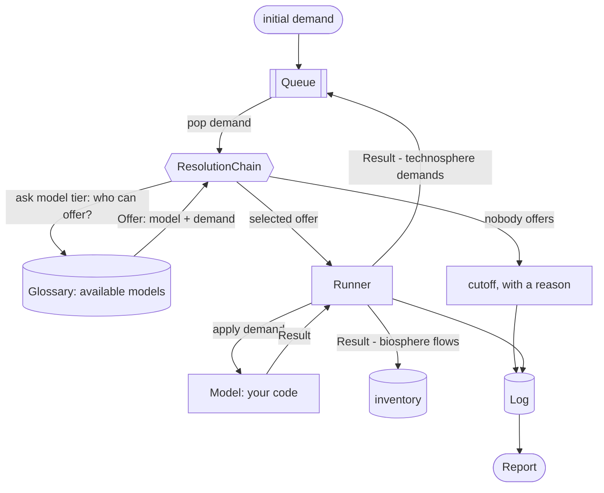

---
tags:
  - tutorial
---

# The 5-minute tour

One demand, carried end to end.

**1000 kg of CO<sub>2</sub> captured from the air, in Switzerland, in 2030.**

Ordinary practice answers that by looking the process up in a dataset and
multiplying. `trailrunner` asks a model, and the model answers for the demand it
was actually given, in the place and the year it was given. Everything on this
page follows from that one change.

Every number and every block of output came out of
[`examples/showcase.ipynb`](https://github.com/TimoDiepers/trailrunner/blob/main/examples/showcase.ipynb),
which runs offline from committed files.

---

## 1. A process is something you run

A [`Model`](api/model.md) has one method. It takes a [`Demand`](api/flow.md) and
returns a [`Result`](api/result.md), answering three questions at once. What did
I make, what do I need, what did I emit.

```python
answer = plant.apply(DEMAND)  # no orchestrator involved, a model is callable on its own
```

```text
   production    1000.0 kg   Carbon dioxide                   @CH/2030
 technosphere    5000.0 MJ   heat from main producers of heat @CH/2030
 technosphere     400.0 kWh  electricity                      @CH/2030
    biosphere   -1000.0 kg   co2-from-air                     @CH/2030
   provenance  {'location_requested': 'CH', 'location_used': 'CH', 'location_fallback': False, 'time_requested': 2030, 'time_used': 2030, 'time_interpolated': False}
```

Three lists, three destinations. `production` is checked against the demand that
triggered the run and then dropped. `technosphere` goes back on the queue, and
is where the traversal comes from. `biosphere` accumulates into the inventory.
`provenance` records which parameter row the model read and which fallbacks it
took.

The demand arrives as an argument, so the answer can depend on it. Inside
`DirectAirCapture` the regeneration heat responds to the air the plant is
breathing, because colder and drier air carries less CO<sub>2</sub> and less
water to the sorbent per unit of air moved.

```python
penalty = ambient_penalty(row["temperature"], row["humidity"])
heat = row["heat_demand"] * penalty * demand.amount
```

The same 1000 kg, asked for in four different places and years.

```text
 where   when   degC     RH   penalty   heat [MJ]
    CH   2020    9.0   0.75     0.995      5970.0
    CH   2030   10.0   0.70     1.000      5000.0
   RER   2020   11.0   0.68     0.996      6573.6
   RER   2030   12.0   0.65     0.995      5472.5
```

`apply` receives the **full** demanded amount, the whole thing that was asked
for, and nothing downstream rescales what comes back. A model whose response
bends with scale can say so.

A model can also compute nothing at all. Where a process has been measured, the
same `Result` carries metered emissions for that place and that year, read from
the same parquet any other parameter comes from.

---

## 2. Models find each other through a vocabulary

Every flow is identified by an IRI from the hierarchical
[sentier vocabulary](https://vocab.sentier.dev). A `Demand` for
`…/BONSAI2025.1/fi_1730_9` finds whoever declared that same IRI in `produces`,
with no name matching and no unit guessing in between. That is what lets two
models written by two people compose at all, and it is what the orchestrator
uses to walk outward.



`Orchestrator.calculate` is a `while queue:` and little else. Pop a demand, ask
the chain who can answer it, hand the offer to the [`Runner`](api/runner.md),
push the `Result`'s technosphere demands back on, write everything to the
[`Log`](api/log.md). Every seam in that sentence is an object you can replace,
which also makes the loop easy to watch. Subclass the chain, print each demand
it is asked about, and the traversal narrates itself.

```python
class Narrating(ResolutionChain):
    def offer(self, demand, exclude=()):
        offer = super().offer(demand, exclude=exclude)
        who = type(offer.model).__name__ if offer else "cutoff (nobody offered)"
        print(f"pop {demand.amount:>9.4g} {demand.unit:<4} {name(demand.flow.iri, 32):<32} -> {who}")
        return offer


first = Orchestrator(Narrating([ModelProvider(Glossary(MODELS))])).calculate(DEMAND)
```

```text
pop      1000 kg   Carbon dioxide                   -> DirectAirCapture
pop      5000 MJ   heat from main producers of heat -> cutoff (nobody offered)
pop       400 kWh  electricity                      -> GridElectricity
pop     8.511 kWh  electricity-natural-gas          -> GasPower
pop      76.6 kWh  electricity-wind                 -> cutoff (nobody offered)
pop     340.4 kWh  electricity-hydro                -> cutoff (nobody offered)
pop     49.42 MJ   Natural gas, liquefied or in th… -> cutoff (nobody offered)
```

Seven pops, breadth-first, and every pop after the first is a demand some
earlier model returned. The supply chain assembled itself from four registered
models and one starting demand.

The names come from the vocabulary as well. Each concept carries a
`skos:prefLabel`, read here from a committed cache, so the run prints in words.
Two lines still show identifiers, because `electricity-wind` and
`electricity-hydro` are `trailrunner`'s own invented IRIs and the vocabulary has
no concept for them. Beat 3 returns to that.

Three pops found a model. Four found nobody, and those four are in the report
with a reason and a parent.

```text
3 nodes, 2 inventory entries
4 unresolved (no_model_found: 4)
0 proxies
attribution: allocation=none, capital=per_output

1000 kg Carbon dioxide @CH/2030  [model: DirectAirCapture]
  400 kWh electricity @CH/2030  [model: GridElectricity]
    8.51064 kWh electricity-natural-gas @CH/2030  [model: GasPower]
      49.4166 MJ Natural gas, liquefied or in the gaseous state @CH/2030  [cutoff: no_model_found]
    76.5957 kWh electricity-wind @CH/2030  [cutoff: no_model_found]
    340.426 kWh electricity-hydro @CH/2030  [cutoff: no_model_found]
  5000 MJ heat from main producers of heat @CH/2030  [cutoff: no_model_found]
```

A gap in the supply chain is data in the answer. Every line says how honestly it
was reached, and a cutoff hangs under the node that asked for it.

---

## 3. A demand nobody answers is relaxed along the vocabulary

[`ResolutionChain`](api/resolution.md) is a list of providers, asked in order,
and the first offer wins. Tier 1 is the models. Every later tier is a
concession, and the tier that made it writes what it conceded into the node's
resolution.

**Tier 2 generalises the demand.** Nothing produces `fi_1730_9`, "heat from main
producers of heat". One `skos:broader` step up sits `fi_1730`, "Steam and hot
water", a real BONSAI concept read from a committed cache. A gas CHP registered
at the parent can answer the relaxed demand, and the report says in words how
far the demand travelled.

```text
       model: GasCHP
 relaxations: ['product: fi_1730_9 -> fi_1730']
       asked: https://vocab.sentier.dev/products/bonsai/2025.1/BONSAI2025.1/fi_1730_9 @CH/2030
    answered: https://vocab.sentier.dev/products/bonsai/2025.1/BONSAI2025.1/fi_1730 @CH/2030
        tier: generalising

   asked, in words: heat from main producers of heat
answered, in words: Steam and hot water
```

**Tier 3 borrows a dataset.** Given its `Fleet`, `DirectAirCapture` demands each
plant's construction in the year that plant was built, and a construction model
turns that into steel and aluminium taken from a curated background pack.

```text
10 nodes, 6 inventory entries
4 unresolved (generalisation_exhausted: 4)
5 proxies (4 incomplete)
attribution: allocation=economic, capital=per_output

1000 kg Carbon dioxide @CH/2030  [model: DirectAirCapture]
  5000 MJ heat from main producers of heat @CH/2030  [proxy: product: fi_1730_9 -> fi_1730]
    5070.42 MJ Natural gas, liquefied or in the gaseous state @CH/2030  [cutoff: generalisation_exhausted]
  400 kWh electricity @CH/2030  [model: GridElectricity]
    8.51064 kWh electricity-natural-gas @CH/2030  [model: GasPower]
      49.4166 MJ Natural gas, liquefied or in the gaseous state @CH/2030  [cutoff: generalisation_exhausted]
    76.5957 kWh electricity-wind @CH/2030  [cutoff: generalisation_exhausted]
    340.426 kWh electricity-hydro @CH/2030  [cutoff: generalisation_exhausted]
  11.5385 kg/year direct-air-capture-plant @CH/2026  [model: DacPlantConstruction]
    34.6154 kg steel-low-alloyed @CH/2026  [background: unit_process, incomplete]
    17.3077 kg aluminium-primary @CH/2026  [background: unit_process, incomplete]
  38.4615 kg/year direct-air-capture-plant @CH/2029  [model: DacPlantConstruction]
    115.385 kg steel-low-alloyed @CH/2029  [background: unit_process, incomplete]
    57.6923 kg aluminium-primary @CH/2029  [background: unit_process, incomplete]
```


Ten nodes now, and the tag on each line says which tier put it there. The
borrowed rows carry `incomplete` because the pack holds each dataset's direct
exchanges only, so their own upstream is missing and the report says so.

Every concession is deliberate, ordered by the practitioner, and written down.

!!! warning "What this beat does not claim"

    - `GasCHP` and `DacPlantConstruction` are written in the notebook rather
      than shipped, because nothing in this repository produces `fi_1730` and
      nothing in it co-produces. Their efficiencies, prices and material
      intensities are invented. The `skos:broader` walk, the pack lookup, the
      completeness flag and the construction pulse are the library.
    - `direct-air-capture-plant`, `electricity-wind`, `electricity-hydro` and
      `electricity-natural-gas` are `trailrunner`'s own IRIs. The vocabulary
      answers 404 for them, which is why they have no printed name and why the
      product dimension can never relax them. They stay cutoffs.
    - The background pack holds no electricity dataset, deliberately. A grid-mix
      unit process delegates its combustion upstream, so borrowing one would
      answer a kilowatt hour with a plausible looking near-zero. A visible
      cutoff is worth more.

---

## 4. The judgement calls stay with the practitioner

The CHP makes heat and electricity. How its burden splits between them is a
choice, and `trailrunner` will not make it for you. The refusal happens in the
`Runner`, between applying the model and validating what came back, so the model
neither makes the choice nor sees it.

```text
allocation='none' -> GasCHP returned co-products (https://vocab.sentier.dev/products/bonsai/2025.1/BONSAI2025.1/fi_17100) but the run's allocation rule is 'none'; model it monofunctionally or choose a rule
```

Choose a rule and the run proceeds, carrying the rule with it.

```text
     economic:    -580.6 kg CO2-eq   (4 unresolved (generalisation_exhausted: 4))
 substitution:    -311.3 kg CO2-eq   (7 unresolved (generalisation_exhausted: 7, of which 3 on a credit branch))

what the CHP node recorded under substitution:
  allocation: substitution
  share: 1.0
  substituted: ['https://vocab.sentier.dev/products/bonsai/2025.1/BONSAI2025.1/fi_17100']
```

Same model, same 1000 kg, and 581 kg of CO<sub>2</sub>-eq removed under one rule
against 311 kg under the other. Under `substitution` the credit goes back on the
queue as a negative demand, is answered by someone other than the CHP, and has
its own cutoffs counted separately.

The gap between the two numbers is set by `GasCHP`'s invented prices, since
economic allocation partitions by revenue. What the run demonstrates is that the
rule moves the answer and that the report records which rule ran.

---

## 5. Time rides along

Nothing in the loop was ever told about time. A [`Flow`](api/flow.md) carries its
year the way it carries its location, so every demand pushed, every emission
accumulated and every node logged is already dated. The plants doing the
capturing were built in 2026 and 2029. The capture, and the gas heat driving it,
happen in 2030.

So the inventory is a time series, and can be characterized as one.

```python
dynamic = assess_dynamic(report, metric="radiative_forcing", horizon=100)
```

```text
-5.14244e-11 W·yr/m2
metric: radiative_forcing, horizon: 100 years
horizon anchored at: 2026-01-01
0 uncharacterized exchanges
0 wrong unit exchanges
0 undated exchanges
0 beyond-horizon exchanges
4 unresolved
5 proxies
```


The faint bars are the per-year forcing and the red line is its running total.
It starts above zero, where the plants were built, and turns down once the
capture lands in 2030. Four warming years, then a century of payback, because of
*when* each kilogram happened as much as how much of it there was. A static
score gives one number for all of that.

No matrix was rebuilt and no second model was written. Characterization is a
separate reading of an inventory whose dates were never lost.

---

## 6. The run leaves a record

```python
print(report.summary())
report.log.to_parquet("showcase_log.parquet")
```

```text
10 nodes, 6 inventory entries
4 unresolved (generalisation_exhausted: 4)
5 proxies (4 incomplete)
attribution: allocation=economic, capital=per_output

wrote showcase_log.parquet: 142 rows, 19 columns
kinds: ['attribution', 'biosphere', 'node', 'provenance', 'resolution', 'unresolved']
```


Every node, every cutoff, every parameter fallback, every proxy and the rule
that made the number, one row each. Parameters arrive as parquet and the whole
run leaves as parquet, so two studies can be diffed with a single read.

---

## What this changes

- **A process can depend on its demand.** Location, year, scale and ambient
  conditions live in the model, where a physical dependency belongs.
- **A model can be a measurement.** Metered data for one place and year enters
  the same way computed data does.
- **The supply chain assembles itself.** Models declare vocabulary IRIs, and the
  orchestrator finds who answers what.
- **Missing data is visible.** Cutoffs carry a reason and a position in the
  chain, so a reader can see what a number excludes.
- **Concessions are declared and recorded.** A generalised demand or a borrowed
  dataset is tagged at the node, with what was asked and what answered it.
- **Normative choices are the study's.** A co-producing model waits for the
  allocation rule, and the rule travels with the result.
- **Inventories are time-explicit by construction.** Dates survive the
  traversal, so dynamic characterization needs no second model.
- **The run is a file.** One parquet holds the graph, the gaps and the choices.

??? note "Presenting this"

    Beats 1, 2 and 5 are the argument and should be read whatever happens to the
    clock. They come to roughly three minutes. Beat 3 is where `GasCHP` and
    `DacPlantConstruction` arrive, so cutting it also costs beat 5's construction
    pulse its explanation.

    Cut in this order. Beat 6 first, then beat 4, then the second half of beat 3.

    Two lines are worth saying aloud rather than reading. On beat 2, after the
    pop trace, that a matrix gives you a number here and no list of what was
    missing from it. On beat 3, that a borrowed row whose upstream is missing is
    labelled rather than laundered. Read the disclaimer in beat 3 before the
    output rather than after it.

---

- The notebook this page is made of: [`examples/showcase.ipynb`](https://github.com/TimoDiepers/trailrunner/blob/main/examples/showcase.ipynb)
- The same pieces in reference form: [Core Concepts](content/concepts.md)
- [Installation](content/installation.md)
