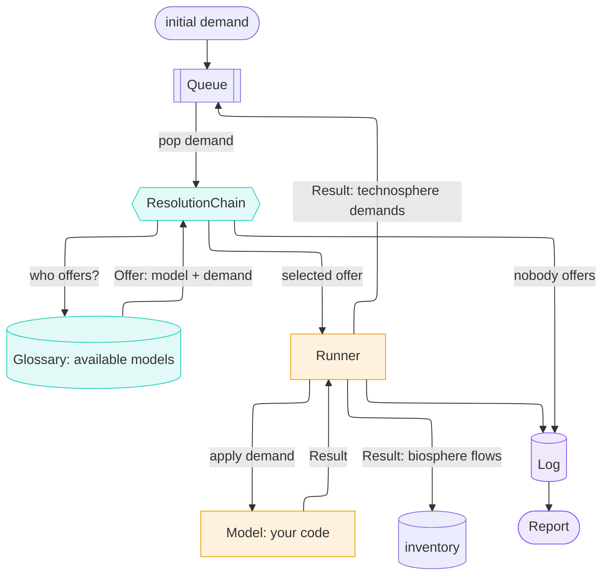

---
tags:
  - tutorial
---

# The 5-minute tour

What is the impact of **1000 kg of Portland cement, in Denmark, in 2030?**

Ordinary practice answers that by modelling static unit processes.
`trailrunner` instead builds on computational process model.

Every flow crossing a model's boundary — what it makes, what it needs, what it
emits — is a concept from the hierarchical
[sentier vocabulary](https://vocab.sentier.dev). That is what lets two models
connect to each other.

Every number and every block of output came out of
[`examples/showcase.ipynb`](https://github.com/TimoDiepers/trailrunner/blob/main/examples/showcase.ipynb),
which runs offline from committed files.

---

## 1. What a model does

A [`Model`](api/model.md) has one method. It takes a [`Demand`](api/flow.md) and
returns a [`Result`](api/result.md), answering three questions at once. What did
I make, what do I need, what did I emit.

```python
answer = cement_model.apply(DEMAND)
```

```text
                 amount unit flow                                         where  when
   production    1000.0 kg   Portland cement, aluminous cement, slag cem… DK     2030
 technosphere    1125.0 kg   Gypsum; anhydrite; limestone flux; limeston… DK     2030
 technosphere    2475.0 MJ   Natural gas, liquefied or in the gaseous st… DK     2030
 technosphere      10.0 kg   Quicklime, slaked lime and hydraulic lime    DK     2030
 technosphere     100.0 kWh  electricity                                  DK     2030
    biosphere     397.5 kg   co2-fossil                                   DK     2030
    biosphere     138.6 kg   co2-fossil                                   DK     2030
   provenance  {'location_requested': 'DK', 'location_used': 'DK', 'location_fallback': False, 'time_requested': 2030, 'time_used': 2030, 'time_interpolated': False, 'source': 'modelled'}
```

Every name printed there — `Quicklime, slaked lime and hydraulic lime`,
`co2-fossil` — is the vocabulary's label for a real concept.

Because the cement plant is a computation model, we can do additional calculations, taking into account the context the process is run in. 
This data is retrieved from a set of parquet files based on their embedded metadata, created with [`trailpack`](https://github.com/TimoDiepers/trailpack).
For example, fuel demands could increase with higher ambient moisture and lower temperatures:

```python
penalty = moisture_penalty(row["moisture"], row["temperature"])
fuel = row["fuel_demand"] * clinker * penalty
```

The same 1000 kg, asked for in four different places and years:

```text
 where   when  moisture   degC   penalty   gas [MJ]
    DK   2030     0.040   10.0     1.000     2475.0
    DK   2040     0.040   11.0     0.996     2099.6
   RER   2030     0.060    9.0     1.044     2923.2
   RER   2040     0.055   10.0     1.030     2447.3
```

Not every process needs computing, though: where a process has real history —
years of stack-monitor readings, say — trailrunner reads that instead of
calculating it, and reaches for a computational model only where there is
none, such as a future year or a process that does not exist yet.

The plant has a stack monitor and years of historic readings.
`MeteredCementPlant` declares the same product IRI as `CementPlant` and a
`Coverage` that ends where the other one begins. Nothing else changes:
[`Glossary`](api/glossary.md)`.resolve` already filters candidates by
coverage, so the year on the demand decides which one answers.

```python
coverage = Coverage(time_range=(2018, 2025))  # MeteredCementPlant
coverage = Coverage(time_range=(2026, 2050))  # CementPlant
```

```text
2023  answered by MeteredCementPlant
      source: measured
      direct CO2:  562.0 kg in 1 exchange(s)
           562.0 kg
2030  answered by CementPlant
      source: modelled
      direct CO2:  536.1 kg in 2 exchange(s)
           397.5 kg
           138.6 kg
```

Look at the biosphere flows above: 2023 has one, 2030 has two. The model
knows which kilogram came from the limestone and which from the flame,
because it computed them separately. The meter does not: a stack monitor sees
one plume and cannot tell you what made it.

Note what the metered model still sends upstream. Its gas, its lime and its
electricity are *inputs* — their emissions happen somewhere else — so they go
back on the queue and are answered by whoever supplies them, exactly as the
computed model's are. A meter at the fence line says nothing about what
happens beyond it.

The normative choices a study still has to make, and a model that co-produces,
are in [`examples/coproduction.ipynb`](https://github.com/TimoDiepers/trailrunner/blob/main/examples/coproduction.ipynb)
and [Attribution](content/attribution.md).

---

## 2. Models find each other through a vocabulary

Every flow is identified by an IRI from the hierarchical
[sentier vocabulary](https://vocab.sentier.dev). A `Demand` for
`…/BONSAI2025.1/fi_37420` finds whoever declared that same IRI in `produces`,
with no name matching and no unit guessing in between. That is what lets two
models written by two people compose at all, and it is what the orchestrator
uses to walk outward.



*Legend: resolution (teal), execution (amber), record (violet).*

`Orchestrator.calculate` is a `while queue:` and little else. Pop a demand, ask
the chain who can answer it, hand the offer to the [`Runner`](api/runner.md),
push the `Result`'s technosphere demands back on, write everything to the
[`Log`](api/log.md). Here's the queue for the cement example:

```text
       amount unit flow                             where  when  -> answered by
pop      1000 kg   Portland cement, aluminous ceme… DK     2030  -> CementPlant
pop      1125 kg   Gypsum; anhydrite; limestone fl… DK     2030  -> cutoff (nobody offered)
pop      2475 MJ   Natural gas, liquefied or in th… DK     2030  -> NaturalGasSupply
pop        10 kg   Quicklime, slaked lime and hydr… DK     2030  -> cutoff (nobody offered)
pop       100 kWh  electricity                      DK     2030  -> GridElectricity
pop     68.75 Nm3  natural-gas-at-production        NO     2030  -> NaturalGasExtraction
pop     50.53 tkm  natural-gas-transport-offshore-… NO     2030  -> NaturalGasOffshorePipelineTransport
pop     8.466 kWh  electricity-natural-gas          DK     2030  -> GasPower
pop     84.66 kWh  electricity-wind                 DK     2030  -> cutoff (nobody offered)
pop      12.7 kWh  electricity-hydro                DK     2030  -> cutoff (nobody offered)
pop 8.995e-08 unit pipeline-natural-gas-long-dista… NO     2030  -> cutoff (nobody offered)
pop   0.01306 Nm3  natural-gas-at-production        NO     2030  -> NaturalGasExtraction
pop     16.54 MJ   natural-gas-burned-in-gas-turbi… NO     2030  -> cutoff (nobody offered)
pop 5.862e-06 tkm  transport-freight-lorry-16t-32t  NO     2030  -> cutoff (nobody offered)
pop 5.862e-05 kg   disposal-used-mineral-oil-10-pe… NO     2030  -> cutoff (nobody offered)
pop     49.16 MJ   Natural gas, liquefied or in th… DK     2030  -> NaturalGasSupply
pop     1.365 Nm3  natural-gas-at-production        NO     2030  -> NaturalGasExtraction
pop     1.004 tkm  natural-gas-transport-offshore-… NO     2030  -> NaturalGasOffshorePipelineTransport
pop 1.786e-09 unit pipeline-natural-gas-long-dista… NO     2030  -> cutoff (nobody offered)
pop 0.0002594 Nm3  natural-gas-at-production        NO     2030  -> NaturalGasExtraction
pop    0.3285 MJ   natural-gas-burned-in-gas-turbi… NO     2030  -> cutoff (nobody offered)
pop 1.164e-07 tkm  transport-freight-lorry-16t-32t  NO     2030  -> cutoff (nobody offered)
pop 1.164e-06 kg   disposal-used-mineral-oil-10-pe… NO     2030  -> cutoff (nobody offered)
```

The fuel is not a leaf any more. `NaturalGasSupply` answers the kiln's 2475 MJ,
turns them into wellhead volume and route length, and hands those on to a gas
field and to `NaturalGasOffshorePipelineTransport` — a model reverse-engineered
from the BAFU/ecoinvent pipeline datasets, which sat in this list long before
anything asked it for a tonne-kilometre. Note where the pipeline runs: the
supply model places both demands at the **origin**, so Danish gas is
transported in `NO` and its leakage is priced at the Norwegian shelf's
low-leakage tier rather than at a Danish average that does not exist.

Everything else found nobody, and every one of those is in the report with a
reason and a parent.

```text
11 nodes, 11 inventory entries
12 unresolved (no_model_found: 12)
0 proxies
attribution: allocation=none, capital=per_output

1000 kg Portland cement, aluminous cement, slag cement and similar hydraulic cements, except in the form of clinkers @DK/2030  [model: CementPlant]
  2475 MJ Natural gas, liquefied or in the gaseous state @DK/2030  [model: NaturalGasSupply]
    68.75 Nm3 natural-gas-at-production @NO/2030  [model: NaturalGasExtraction]
    50.5312 tkm natural-gas-transport-offshore-pipeline-long-distance @NO/2030  [model: NaturalGasOffshorePipelineTransport]
      0.0130625 Nm3 natural-gas-at-production @NO/2030  [model: NaturalGasExtraction]
      8.99456e-08 unit pipeline-natural-gas-long-distance-high-capacity-offshore @NO/2030  [cutoff: no_model_found]
      16.5404 MJ natural-gas-burned-in-gas-turbine @NO/2030  [cutoff: no_model_found]
      5.86162e-06 tkm transport-freight-lorry-16t-32t @NO/2030  [cutoff: no_model_found]
      5.86162e-05 kg disposal-used-mineral-oil-10-percent-water-hazardous-waste-incineration @NO/2030  [cutoff: no_model_found]
  100 kWh electricity @DK/2030  [model: GridElectricity]
    8.46561 kWh electricity-natural-gas @DK/2030  [model: GasPower]
      49.1551 MJ Natural gas, liquefied or in the gaseous state @DK/2030  [model: NaturalGasSupply]
        1.36542 Nm3 natural-gas-at-production @NO/2030  [model: NaturalGasExtraction]
        1.00358 tkm natural-gas-transport-offshore-pipeline-long-distance @NO/2030  [model: NaturalGasOffshorePipelineTransport]
          0.00025943 Nm3 natural-gas-at-production @NO/2030  [model: NaturalGasExtraction]
          1.78638e-09 unit pipeline-natural-gas-long-distance-high-capacity-offshore @NO/2030  [cutoff: no_model_found]
          0.328503 MJ natural-gas-burned-in-gas-turbine @NO/2030  [cutoff: no_model_found]
          1.16416e-07 tkm transport-freight-lorry-16t-32t @NO/2030  [cutoff: no_model_found]
          1.16416e-06 kg disposal-used-mineral-oil-10-percent-water-hazardous-waste-incineration @NO/2030  [cutoff: no_model_found]
    84.6561 kWh electricity-wind @DK/2030  [cutoff: no_model_found]
    12.6984 kWh electricity-hydro @DK/2030  [cutoff: no_model_found]
  1125 kg Gypsum; anhydrite; limestone flux; limestone and other calcareous stone, of a kind used for the manufacture of lime or cement @DK/2030  [cutoff: no_model_found]
  10 kg Quicklime, slaked lime and hydraulic lime @DK/2030  [cutoff: no_model_found]
```

---

## 3. A demand nobody answers is relaxed along the vocabulary

[`ResolutionChain`](api/resolution.md) is a list of providers, asked in order,
and the first offer wins. Tier 1 is the computational models. Every later tier is a
concession, and the tier that made it writes what it conceded into the node's
resolution.

**Tier 2 generalises the demand.** The plant blends in a little hydrated lime,
so it asks for `fi_37420`, "Quicklime, slaked lime and hydraulic lime". Nobody
produces it. One `skos:broader` step reaches `fi_3742` — spelled identically,
and produced by nobody either. The *second* step reaches `fi_374`, "Plaster,
lime and cement", and a supplier registered there answers. The report says in
words how far the demand travelled.

```text
       model: BinderSupply
 relaxations: ['product: fi_37420 -> fi_374']
       asked: https://vocab.sentier.dev/products/bonsai/2025.1/BONSAI2025.1/fi_37420 @DK/2030
    answered: https://vocab.sentier.dev/products/bonsai/2025.1/BONSAI2025.1/fi_374 @DK/2030
        tier: generalising

     asked, in words: Quicklime, slaked lime and hydraulic lime
  answered, in words: Plaster, lime and cement

one step up would be: Quicklime, slaked lime and hydraulic lime -- same words, still nobody
```

Notice what that concession costs. `fi_374` is an average over plaster, lime
**and cement** — so a lime demand was answered by a category containing the very
product this plant is making. It is the best answer available and a poor answer
in substance, and it is written at the node rather than lost.

**Tier 3 borrows a dataset.** Given its `Fleet`, `CementPlant` demands each
kiln's construction in the year that kiln was built, and a construction model
turns that into steel and aluminium taken from a curated background pack.

```text
18 nodes, 13 inventory entries
11 unresolved (generalisation_exhausted: 11)
5 proxies (4 incomplete)
attribution: allocation=none, capital=per_output

1000 kg Portland cement, aluminous cement, slag cement and similar hydraulic cements, except in the form of clinkers @DK/2030  [model: CementPlant]
  2475 MJ Natural gas, liquefied or in the gaseous state @DK/2030  [model: NaturalGasSupply]
    68.75 Nm3 natural-gas-at-production @NO/2030  [model: NaturalGasExtraction]
    50.5312 tkm natural-gas-transport-offshore-pipeline-long-distance @NO/2030  [model: NaturalGasOffshorePipelineTransport]
      0.0130625 Nm3 natural-gas-at-production @NO/2030  [model: NaturalGasExtraction]
      8.99456e-08 unit pipeline-natural-gas-long-distance-high-capacity-offshore @NO/2030  [cutoff: generalisation_exhausted]
      16.5404 MJ natural-gas-burned-in-gas-turbine @NO/2030  [cutoff: generalisation_exhausted]
      5.86162e-06 tkm transport-freight-lorry-16t-32t @NO/2030  [cutoff: generalisation_exhausted]
      5.86162e-05 kg disposal-used-mineral-oil-10-percent-water-hazardous-waste-incineration @NO/2030  [cutoff: generalisation_exhausted]
  10 kg Quicklime, slaked lime and hydraulic lime @DK/2030  [proxy: product: fi_37420 -> fi_374]
  100 kWh electricity @DK/2030  [model: GridElectricity]
    8.46561 kWh electricity-natural-gas @DK/2030  [model: GasPower]
      49.1551 MJ Natural gas, liquefied or in the gaseous state @DK/2030  [model: NaturalGasSupply]
        1.36542 Nm3 natural-gas-at-production @NO/2030  [model: NaturalGasExtraction]
        1.00358 tkm natural-gas-transport-offshore-pipeline-long-distance @NO/2030  [model: NaturalGasOffshorePipelineTransport]
          0.00025943 Nm3 natural-gas-at-production @NO/2030  [model: NaturalGasExtraction]
          1.78638e-09 unit pipeline-natural-gas-long-distance-high-capacity-offshore @NO/2030  [cutoff: generalisation_exhausted]
          0.328503 MJ natural-gas-burned-in-gas-turbine @NO/2030  [cutoff: generalisation_exhausted]
          1.16416e-07 tkm transport-freight-lorry-16t-32t @NO/2030  [cutoff: generalisation_exhausted]
          1.16416e-06 kg disposal-used-mineral-oil-10-percent-water-hazardous-waste-incineration @NO/2030  [cutoff: generalisation_exhausted]
    84.6561 kWh electricity-wind @DK/2030  [cutoff: generalisation_exhausted]
    12.6984 kWh electricity-hydro @DK/2030  [cutoff: generalisation_exhausted]
  8.33333 kg/year cement-kiln @DK/2026  [model: CementKilnConstruction]
    0.1 kg steel-low-alloyed @DK/2026  [background: unit_process, incomplete]
    0.00666667 kg aluminium-primary @DK/2026  [background: unit_process, incomplete]
  16.6667 kg/year cement-kiln @DK/2029  [model: CementKilnConstruction]
    0.2 kg steel-low-alloyed @DK/2029  [background: unit_process, incomplete]
    0.0133333 kg aluminium-primary @DK/2029  [background: unit_process, incomplete]
  1125 kg Gypsum; anhydrite; limestone flux; limestone and other calcareous stone, of a kind used for the manufacture of lime or cement @DK/2030  [cutoff: generalisation_exhausted]
```


Every concession is deliberate, ordered by the practitioner, and written down.

---

## 4. Time rides along

Nothing in the loop was ever told about time. A [`Flow`](api/flow.md) carries its
year the way it carries its location, so every demand pushed, every emission
accumulated and every node logged is already dated. The kilns doing the
calcining were built in 2026 and 2029. The cement, and the gas firing the kiln,
happen in 2030.

So the inventory is a time series, and can be characterized as one.

```python
dynamic = assess_dynamic(report, metric="radiative_forcing", horizon=100)
```

```text
4.897e-11 W·yr/m2
metric: radiative_forcing, horizon: 100 years
horizon anchored at: 2026-01-01
18 uncharacterized exchanges
0 wrong unit exchanges
0 undated exchanges
0 beyond-horizon exchanges
11 unresolved
5 proxies

marginal radiative forcing, first years [W/m2]:
date
2027    2.973750e-17
2028    5.434073e-17
2029    2.520040e-17
2030    5.947499e-17
2031    9.120960e-13
2032    1.666609e-12
```

The default characterization functions cover the CO<sub>2</sub> and the
methane, which is where the calcination, the combustion and the pipeline's
leakage are written. The 18 uncharacterized exchanges are the rest of what the
gas chain emits — ethane, mercury, NMVOC, and the gas taken out of the ground —
which no climate method scores. They are listed rather than dropped, because a
flow silently worth zero and a flow genuinely worth zero read identically in a
total.


The faint bars are the per-year forcing and the red line is its running total.
The kilns show up in 2027 and 2029, and then 2031 arrives and the scale of the
plot changes: building two cement plants is four orders of magnitude below one
year of making cement in them. That is not a flaw in the example. It is what the
industry's problem actually looks like, and it is visible here only because the
dates survived.

No matrix was rebuilt and no second model was written. Characterization is a
separate reading of an inventory whose dates were never lost.

---

## 5. The run leaves a record

```python
print(report.summary())
report.log.to_parquet("showcase_log.parquet")
```

```text
18 nodes, 13 inventory entries
11 unresolved (generalisation_exhausted: 11)
5 proxies (4 incomplete)
attribution: allocation=none, capital=per_output

wrote showcase_log.parquet: 298 rows, 19 columns
kinds: ['attribution', 'biosphere', 'node', 'provenance', 'resolution', 'unresolved']
```


Every node, every cutoff, every parameter fallback and every proxy, one row
each. Parameters arrive as parquet and the whole run leaves as parquet, so two
studies can be diffed with a single read.

---

## What this changes

- **The supply chain assembles itself.** Models declare vocabulary IRIs, and the
  orchestrator finds who answers what.
- **Missing data is visible.** Cutoffs carry a reason and a position in the
  chain, so a reader can see what a number excludes.
- **Concessions are declared and recorded.** A generalised demand or a borrowed
  dataset is tagged at the node, with what was asked and what answered it.
- **Inventories are time-explicit by construction.** Dates survive the
  traversal, so dynamic characterization needs no second model.
- **The run is a file.** One parquet holds the graph, the gaps and the choices.
- **A process can depend on its demand.** Location, year, scale and feed
  conditions live in the model, where a physical dependency belongs.
- **A model can be a measurement.** Two models, one product, disjoint coverage:
  the year on the demand decides whether you get a meter reading or a
  calculation, and the report says which.

---

- The notebook this page is made of: [`examples/showcase.ipynb`](https://github.com/TimoDiepers/trailrunner/blob/main/examples/showcase.ipynb)
- The same pieces in reference form: [Core Concepts](content/concepts.md)
- [Installation](content/installation.md)
