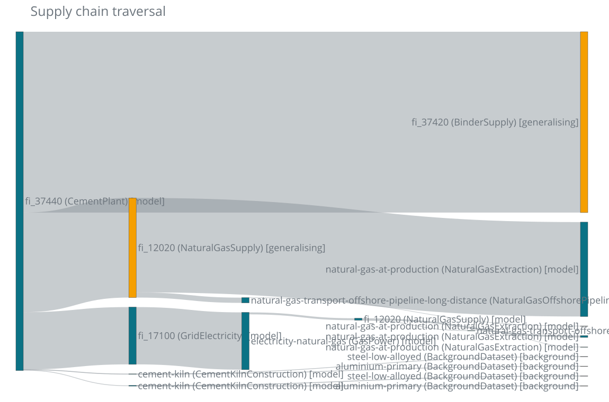
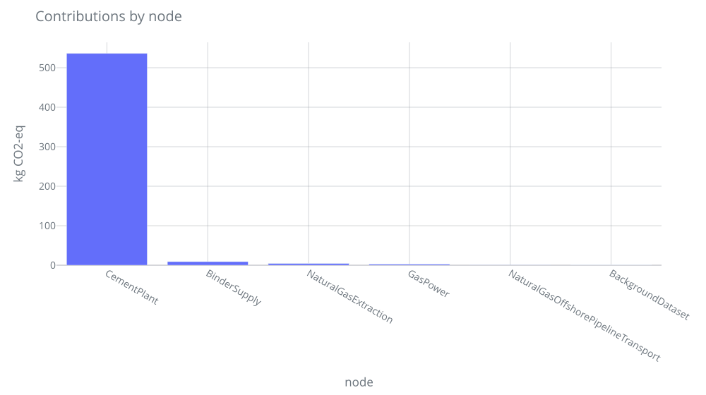

---
tags:
  - tutorial
---

# The 5-minute tour

One demand, carried end to end:

**1000 kg of CO<sub>2</sub> captured from the air — in Switzerland, in 2030.**

The usual way to answer that is to multiply a column of fixed coefficients. You
know what that looks like, and you know where it stops: the column says the same
thing in Iceland as in Switzerland, in 2045 as in 2030.

`trailrunner` answers it by *running* the supply chain instead. So this page is
mostly about the machine — what the pieces are, which piece holds which
decision, and what the run leaves behind. Every number and every block of output
came out of
[`examples/showcase.ipynb`](https://github.com/TimoDiepers/trailrunner/blob/main/examples/showcase.ipynb),
which runs offline, from committed files alone.

??? note "Presenter note (running order)"
    Beats 1, 2, 3 and 6 are the argument: the architecture, and the one thing
    the architecture buys that a matrix cannot. They must be read whatever
    happens to the clock, and they come to about **4:00**. Beat 4 is where
    `GasCHP` and `DacPlantConstruction` arrive, and without them beat 6's
    construction pulse is unintelligible — so if the clock allows exactly one
    more beat, it is 4, not 5.

    Timed at a conference-realistic **130 words a minute** — a reading pace is
    faster than a speaking one — with a beat of silence on each block of output,
    all seven beats run about **7:15**. Five minutes therefore means cutting,
    and the cuts are: **beat 7 first** (−0:25), then 5 (−1:05), then the second
    half of 4 (−0:45). Decide which cut you are making before you start, not at
    minute four.

---

## 1. The shape of the run

One demand goes in. Six objects pass it around until the queue is empty.


| Part | Its one job |
| --- | --- |
| [`Demand`](api/flow.md) | an amount and a unit of a `Flow` — *what*, *where*, *when* |
| [`Queue`](api/queue.md) | the demands still waiting; FIFO unless you hand it a priority |
| [`ResolutionChain`](api/resolution.md) | asks each tier in order; the model tier asks the [`Glossary`](api/glossary.md) for a `(model, demand)` offer, and the first offer wins |
| [`Model`](api/model.md) | one process, as code: `apply(demand) -> Result` |
| [`Runner`](api/runner.md) | applies the model and validates the `Result` against the demand |
| [`Log`](api/log.md) | append-only: every node, edge, cutoff, fallback and rule |

The seams are the point. The traversal never learns how a process works, and a
process never learns what else is in the supply chain: a model *returns*
demands rather than looking anything up, so it cannot reach into the graph and
does not know whether anyone will answer it. The rest of this page is those six
objects, one beat at a time.

??? note "Presenter note (0:50)"
    Say: there is no matrix in this picture, and no solver. There is a queue and
    a loop. Trace the cycle with a finger — pop, resolve, apply, the technosphere
    goes *back* on the queue — and say "that arrow is the supply chain". Then
    say the seam sentence: a model returns demands, it never looks anything up.
    Do not read the table aloud; it is there for the person who photographs the
    slide.

---

## 2. A process is a function from `Demand` to `Result`

That is the whole model contract. `apply` receives the demand — the **full**
amount, never a unit demand — and answers three questions at once: what did I
make, what do I need, what did I emit?

```python
answer = plant.apply(DEMAND)  # no orchestrator involved: a model is callable on its own
```

```text
   production    1000.0 kg   fi_2811_21    @CH/2030
 technosphere    5000.0 MJ   fi_1730_9     @CH/2030
 technosphere     400.0 kWh  fi_17100      @CH/2030
    biosphere   -1000.0 kg   co2-from-air  @CH/2030
   provenance  {'location_requested': 'CH', 'location_used': 'CH', 'location_fallback': False, 'time_requested': 2030, 'time_used': 2030, 'time_interpolated': False}
```

Three lists, three destinations, and the orchestrator needs to know nothing else
about direct air capture:

- `production` is checked against the demand that triggered the run and then
  dropped — it is an answer, not an input to anything;
- `technosphere` goes back on the queue, and is where the traversal comes from;
- `biosphere` is added to the inventory.

`provenance` is the model's own record of which parameter row it read and which
fallbacks it took, and rides along to the report.

Why the demand is an argument to a function rather than a multiplier on a
column: the numbers inside `DirectAirCapture` depend on where and when it is
asked.

```python
def ambient_penalty(temperature: float, humidity: float) -> float:
    temperature_term = TEMPERATURE_SENSITIVITY * (REFERENCE_TEMPERATURE - temperature)
    humidity_term = HUMIDITY_SENSITIVITY * (REFERENCE_HUMIDITY - humidity)
    return 1.0 + temperature_term + humidity_term
```

The same 1000 kg, asked for in four different places and years:

```text
 where   when   degC     RH   penalty   heat [MJ]
    CH   2020    9.0   0.75     0.995      5970.0
    CH   2030   10.0   0.70     1.000      5000.0
   RER   2020   11.0   0.68     0.996      6573.6
   RER   2030   12.0   0.65     0.995      5472.5
```

Nothing downstream rescales a `Result`, so a model whose response is *not*
proportional to the amount does not have to pretend it is.

**The process is the code.**

??? note "Presenter note (1:00)"
    Say: one method, three lists, and the names of the lists *are* the
    architecture — production is checked, technosphere is queued, biosphere is
    accumulated. Point at the arrow in the diagram the technosphere list feeds.
    Then the ambient function, briefly: the coefficient cannot depend on where
    and when; a function can. Do not explain the sorbent chemistry, and do not
    claim this model is nonlinear in the amount — it is not. What is not a
    coefficient here is the ambient response.

---

## 3. The loop

`Orchestrator.calculate` is a `while queue:` and little else. Pop a demand, ask
the chain who can answer it, hand the offer to the `Runner`, push the `Result`'s
technosphere demands back on, write everything to the `Log`.

Every seam in that sentence is an object you can replace — which also makes the
loop easy to watch. Subclass the chain, print each demand it is asked about, and
the traversal narrates itself. Only the four shipped models are registered here.

```python
class Narrating(ResolutionChain):
    """A chain that says what it was asked. The Orchestrator takes any chain."""

    def offer(self, demand, exclude=()):
        offer = super().offer(demand, exclude=exclude)
        who = type(offer.model).__name__ if offer else "cutoff (nobody offered)"
        print(
            f"pop {demand.amount:>9.4g} {demand.unit:<4} "
            f"{demand.flow.iri.rsplit('/', 1)[-1]:<24} -> {who}"
        )
        return offer


tier1 = ModelProvider(Glossary(MODELS))
first = Orchestrator(Narrating([tier1])).calculate(DEMAND)
```

```text
pop      1000 kg   fi_2811_21               -> DirectAirCapture
pop      5000 MJ   fi_1730_9                -> cutoff (nobody offered)
pop       400 kWh  fi_17100                 -> GridElectricity
pop     8.511 kWh  electricity-natural-gas  -> GasPower
pop      76.6 kWh  electricity-wind         -> cutoff (nobody offered)
pop     340.4 kWh  electricity-hydro        -> cutoff (nobody offered)
pop     49.42 MJ   fi_12020                 -> cutoff (nobody offered)
```

Seven pops, breadth-first, and every pop after the first is a demand some
earlier model returned. Three found a model; four found nobody. Nothing was
dropped and nothing was quietly zero — the misses are cutoff leaves in the
report, each with a reason and a parent, and `tree()` is the log read back as
the graph it recorded.

```text
3 nodes, 2 inventory entries
4 unresolved (no_model_found: 4)
0 proxies
attribution: allocation=none, capital=per_output

1000 kg fi_2811_21 @CH/2030  [model: DirectAirCapture]
  400 kWh fi_17100 @CH/2030  [model: GridElectricity]
    8.51064 kWh electricity-natural-gas @CH/2030  [model: GasPower]
      49.4166 MJ fi_12020 @CH/2030  [cutoff: no_model_found]
    76.5957 kWh electricity-wind @CH/2030  [cutoff: no_model_found]
    340.426 kWh electricity-hydro @CH/2030  [cutoff: no_model_found]
  5000 MJ fi_1730_9 @CH/2030  [cutoff: no_model_found]
```

A loop in the supply chain is bounded, not solved: every visit is its own node,
nodes are never merged, and `max_depth` and `max_nodes` stop a cycle and set
`report.truncated`. A truncated tree with an honest cutoff list beats a
converged number nobody can check.

The same walk from the command line, no notebook involved:

```bash
uv run trailrunner run \
  "https://vocab.sentier.dev/products/bonsai/2025.1/BONSAI2025.1/fi_2811_21" \
  --amount 1000 --unit kg --location CH --year 2030 \
  --models examples/showcase_models.py
```

**Every node says how honestly it was answered.**

??? note "Presenter note (0:50)"
    Say: this is the loop from beat 1, printing itself — the trace is the queue
    order, not a summary written afterwards. Read one cutoff line out loud, then
    say: a matrix gives you a number here and no list of what was missing from
    it; this gives you both. The heat cutoff at 5000 MJ is the biggest of them,
    and it is the next beat.

---

## 4. When nobody answers: the chain, tier by tier

`ResolutionChain` is a list of providers, asked in order, first offer wins. Tier
1 is the models. Every later tier is a concession — and the tier that made it
writes what it conceded into the node's resolution, so a proxy number is never
mistaken for an exact one. The order is yours to declare: no library default
decides whether a widened region beats a borrowed dataset.

```python
CHAIN = ResolutionChain([tier1, tier2, BackgroundProvider(pack)])
report = Orchestrator(CHAIN, settings=settings).calculate(DEMAND)
```

**Tier 2 generalises the demand.** Nothing produces `fi_1730_9`, "heat from main
producers of heat". One level up `skos:broader` sits `fi_1730`, "Steam and hot
water" — a real BONSAI concept, read from the committed
`examples/pyst_cache.json`: no network, no token. A gas CHP registered there
answers the relaxed demand.

**Tier 3 borrows a dataset.** Given its `Fleet`, `DirectAirCapture` demands each
plant's construction **in the year that plant was built**. A construction model
turns that into steel and aluminium, borrowed from the background pack.

**Two of the models below are written on this page, not shipped.** Nothing in
this repository produces `fi_1730`, and nothing in it co-produces — so there was
no target for the generalisation tier to find, and nothing for beat 5 to
allocate. `GasCHP` and `DacPlantConstruction` exist so those mechanisms have
something to bite on. Their efficiencies, prices and material intensities are
invented. Everything around them is not: the `skos:broader` walk, the pack
lookup, the completeness flag, the credit traversal and the construction pulse
are the library, and every block of output below is what it actually printed.

```text
10 nodes, 6 inventory entries
4 unresolved (generalisation_exhausted: 4)
5 proxies (4 incomplete)
attribution: allocation=economic, capital=per_output

1000 kg fi_2811_21 @CH/2030  [model: DirectAirCapture]
  5000 MJ fi_1730_9 @CH/2030  [proxy: product: fi_1730_9 -> fi_1730]
    5070.42 MJ fi_12020 @CH/2030  [cutoff: generalisation_exhausted]
  400 kWh fi_17100 @CH/2030  [model: GridElectricity]
    8.51064 kWh electricity-natural-gas @CH/2030  [model: GasPower]
      49.4166 MJ fi_12020 @CH/2030  [cutoff: generalisation_exhausted]
    76.5957 kWh electricity-wind @CH/2030  [cutoff: generalisation_exhausted]
    340.426 kWh electricity-hydro @CH/2030  [cutoff: generalisation_exhausted]
  11.5385 kg/year direct-air-capture-plant @CH/2026  [model: DacPlantConstruction]
    34.6154 kg steel-low-alloyed @CH/2026  [background: unit_process, incomplete]
    17.3077 kg aluminium-primary @CH/2026  [background: unit_process, incomplete]
  38.4615 kg/year direct-air-capture-plant @CH/2029  [model: DacPlantConstruction]
    115.385 kg steel-low-alloyed @CH/2029  [background: unit_process, incomplete]
    57.6923 kg aluminium-primary @CH/2029  [background: unit_process, incomplete]
```

The same walk as beat 3 — ten nodes now instead of three — and the tag on each
line says which tier put it there. `report.proxies` holds the long form of
every non-exact answer:

```text
       model: GasCHP
 relaxations: ['product: fi_1730_9 -> fi_1730']
       asked: https://vocab.sentier.dev/products/bonsai/2025.1/BONSAI2025.1/fi_1730_9 @CH/2030
    answered: https://vocab.sentier.dev/products/bonsai/2025.1/BONSAI2025.1/fi_1730 @CH/2030
        tier: generalising
```



The borrowed rows say `incomplete` because the pack holds each dataset's
*direct* exchanges only: their upstream is missing, and the report says so.

**We concede on purpose, along a declared hierarchy, and we log it.**

!!! warning "What this beat does not claim"

    - `direct-air-capture-plant` is **not** a vocabulary concept — the service
      answers 404 for it — so the product dimension cannot generalise it, and
      nothing here pretends otherwise.
    - `electricity-wind`, `electricity-hydro` and `electricity-natural-gas` are
      likewise `trailrunner`'s own invented IRIs. They stay cutoffs.
    - The background pack has **no electricity dataset, on purpose**: a grid-mix
      unit process delegates its combustion upstream, so borrowing one would
      answer a kilowatt hour with a plausible-looking near-zero. A visible
      cutoff is better than that.

??? note "Presenter note (1:45)"
    Say: the chain is a list, and you wrote the list — that is the whole tier
    mechanism. Then the two concessions: we asked for less, one level up a
    published vocabulary, from a file in the repo; and we borrowed a dataset
    somebody else made. Read the proxy tag aloud. Point at the word `incomplete`
    and say: that is a borrowed row whose own upstream we do not have, and it is
    labelled, not laundered. If asked about the electricity cutoffs, use the box
    above — it is the strongest thing on the page. Read the "written on this
    page, not shipped" paragraph out loud **before** the output, not after it
    and not only if challenged: said first it is the argument, said last it is
    an excuse.

---

## 5. Where a value judgement enters the loop

The CHP makes heat *and* electricity. How its burden splits between them is not
a measurement, it is a choice — and `trailrunner` will not make it for you. The
place it refuses is a specific one: the `Runner`, between applying the model and
validating what came back. The model neither makes the choice nor sees it, which
is why the rule lands in `report.attribution` and never in the model's
provenance.

```python
try:
    walk("none")
except UnallocatedCoProduction as refusal:
    print("allocation='none' ->", refusal)
```

```text
allocation='none' -> GasCHP returned co-products (https://vocab.sentier.dev/products/bonsai/2025.1/BONSAI2025.1/fi_17100) but the run's allocation rule is 'none'; model it monofunctionally or choose a rule
```

```text
     economic:    -580.6 kg CO2-eq   (4 unresolved (generalisation_exhausted: 4))
 substitution:    -311.3 kg CO2-eq   (7 unresolved (generalisation_exhausted: 7, of which 3 on a credit branch))

what the CHP node recorded under substitution:
  allocation: substitution
  share: 1.0
  substituted: ['https://vocab.sentier.dev/products/bonsai/2025.1/BONSAI2025.1/fi_17100']
```

Same model, same 1000 kg: 581 kg of CO<sub>2</sub>-eq removed under one rule,
311 kg under the other. And the credit is not a subtraction at the end — it goes
back on the queue as a *negative* demand, is answered by someone other than the
CHP, and its own cutoffs are counted separately.

The gap between 581 and 311 is set by `GasCHP`'s invented heat and electricity
prices — economic allocation partitions by revenue. What is demonstrated is that
the rule moves the answer and that the report records which rule ran, not that
either number is right for a real CHP.

**The rule is on the report, next to the number it produced.**

??? note "Presenter note (1:05)"
    Say: the library refuses to run until you choose, and the refusal happens in
    the Runner, not in the model. Show the refusal, then the two numbers. Say
    "581 or 311, and neither is wrong" — that is the line. Mention that the
    credit re-enters the queue; it is the one place the loop runs backwards.
    Do not get drawn into which rule is correct.

---

## 6. Time rides along

Nothing in the loop ever had to be told about time. A `Flow` carries its year the
way it carries its location, so every demand pushed, every emission accumulated
and every node logged is already dated. The plants doing the capturing were built
in 2026 and 2029; the capture, and the gas heat driving it, are in 2030. So the
inventory *is* a time series, and can be characterized as one.

```python
# No characterization table is passed: default_functions() maps the DAC uptake
# flow to the ordinary CO2 function, because the model emits it as an already
# negative CO2 exchange and nothing should negate it a second time.
dynamic = assess_dynamic(report, metric="radiative_forcing", horizon=100)
```

```text
-5.14244e-11 W·yr/m2
metric: radiative_forcing, horizon: 100 years
horizon anchored at: 2026-01-01
0 uncharacterized exchanges
0 wrong unit exchanges
0 undated exchanges
0 beyond-horizon exchanges
4 unresolved
5 proxies

marginal radiative forcing, first years [W/m2]:
date
2027    5.054518e-14
2028    9.235309e-14
2029    4.282174e-14
2030    1.684839e-13
2031   -9.756895e-13
2032   -1.776486e-12
```


The faint bars are the per-year forcing; the red line is its running total. It
starts **above** zero — those are the plants built in 2026 and 2029 — and only
turns down once the capture lands in 2030. Four warming years, then a century of
payback, because of *when* each kilogram happened and not only how much of it
there was. A static score gives one number for all of that.

No matrix was rebuilt, no second model was written, and no step in the traversal
knew this was coming: characterization is a separate reading of an inventory
whose dates were never lost. The pulse's size is `DacPlantConstruction`'s
illustrative intensities; the shape — warming first, cooling later — is what the
traversal produced from the dates it carried.

**`bw_temporalis` and `bw_timex` get here too — from a matrix. This got here
because nothing in the architecture ever had to drop the date.**

??? note "Presenter note (1:20)"
    This is the beat, and it is the payoff for beat 1. Slow down. Say: the
    traversal has no notion of time anywhere in it — the flows carried their
    years, so the inventory came out dated for free. Trace the curve with a
    finger: up here, turning here. Then say the punchline and stop talking. The
    punchline names `bw_temporalis` and `bw_timex` on purpose: someone in the
    room knows they do this, and conceding it first is what buys the second half
    of the sentence.

---

## 7. The record

The `Report` is a reading of the `Log`, not a replacement for it. The log goes
to one parquet file under one schema, so two runs can be diffed with a single
read.

```python
print(report.summary())
report.log.to_parquet("showcase_log.parquet")
```

```text
10 nodes, 6 inventory entries
4 unresolved (generalisation_exhausted: 4)
5 proxies (4 incomplete)
attribution: allocation=economic, capital=per_output

wrote showcase_log.parquet: 142 rows, 19 columns
kinds: ['attribution', 'biosphere', 'node', 'provenance', 'resolution', 'unresolved']
```



Every node, every cutoff, every parameter fallback, every proxy, and the rule
that made the number — one row each.

**Parquet in, parquet out, every choice on the record.**

??? note "Presenter note (0:25)"
    Say: the run is a file, and the file includes what the run could not do.
    Then give the two links and stop.

---

- The notebook this page is made of: [`examples/showcase.ipynb`](https://github.com/TimoDiepers/trailrunner/blob/main/examples/showcase.ipynb)
- The same pieces, in reference form: [Core Concepts](content/concepts.md)
- [Installation](content/installation.md)
