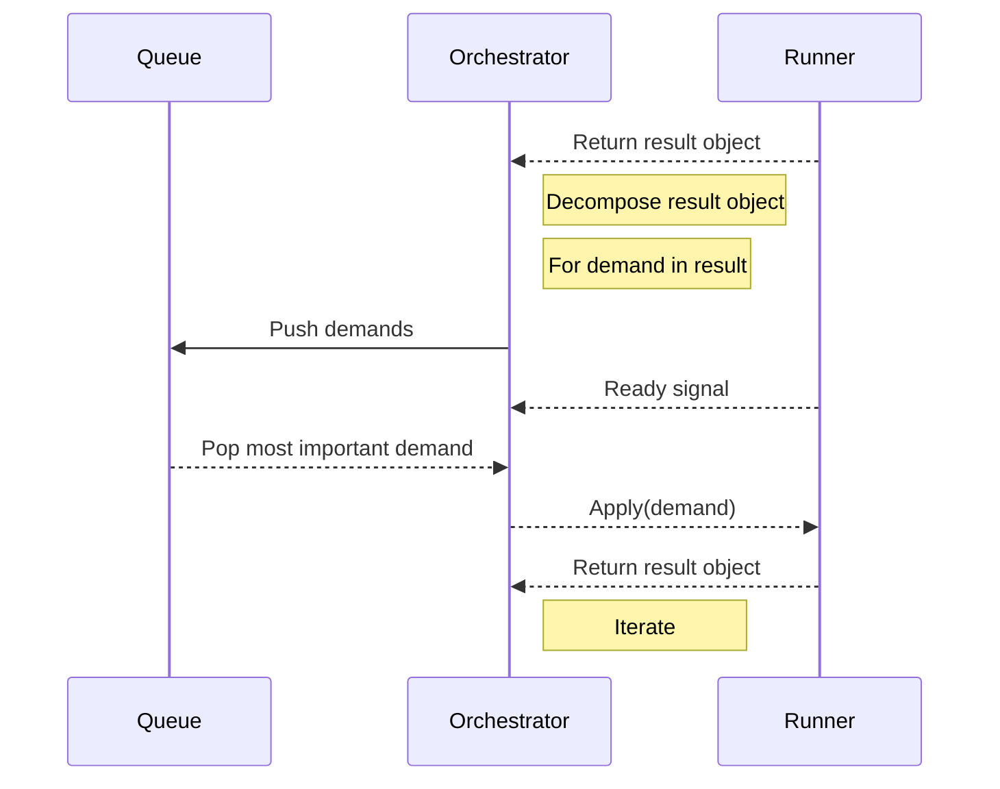

# `TrailRunner`

## Overview

Refer to [this file](https://github.com/sentier-dev/sentier.dev/blob/main/Sequence%20diagrams/README.md) for a general introduction to the context of this work.

Below, we copy two diagrams from that file to help explain what we're talking about.

Running a calculation from the perspective of the orchestrator:

```mermaid
sequenceDiagram
    participant Frontend
    participant Glossary
    participant Orchestrator
    participant Runner
    participant Log
    Frontend-->>Orchestrator: Calculate(impact category, product)
    Orchestrator-->>+Glossary: Who produces product?
    Glossary-->>-Orchestrator: Model reference
    Orchestrator-->>+Runner: Apply(demand)
    Runner-->>-Orchestrator: Return result object
    Orchestrator-->>Log: Write emissions and context from model
    Note right of Orchestrator: Decompose result object
    Orchestrator-->>+Glossary: Who produces dependent product 1? 
    Glossary-->>-Orchestrator: Model reference
    Orchestrator-->>+Runner: Apply(demand)
    Runner-->>-Orchestrator: Return result object
    Note right of Orchestrator: Iterate throughout supply chain
    Log-->>Orchestrator: Read graph structure
    Orchestrator-->>Frontend: Result report
```

Graph traversal:

So, the realisation of any demand is specified by a particular model. The Orchestrator requests the Glossary to find this particular model, which is then executed by the Runner. The result which the Orchestrator receives from the Runner specifies the exchanges that realise the demand: technosphere (intermediate) flows and biosphere (elementary) flows.

+ Each technosphere flow (with all of its attributes) will become a demand for which another model is called, unless some cut-off is reached.
+ Each biosphere flow (with all of its attributes) is stored, to be returned to in the LCIA phase. By definition, any biosphere flow does not lead to any further work within the LCI phase (cf. [`bw_feedback`](https://indico.d-d-s.ch/event/2/contributions/58/)).

A flow can have many attributes. Each of these attributes may be used by the model that next interacts with the flow (an inventory model in the case of technosphere flows, or an impact assessment model in the case of biosphere flows). Here, we focus on the development of such inventory models.

To recap, the basic purpose of an inventory model is to translate the demand for a technosphere flow (with particular attributes) to subsequent sets of technosphere and biosphere flows. It's possible for either of these sets to be empty (although they typically shouldn't both be empty).

There can be all kinds of complications to realising this translation. For example, a demand request for which no direct match exists or the normative choices involved in attributing flows to any particular demand. To empower practitioners to define these choices for themselves (and to create understanding of how these choices affect the results), models can operate following some combination of settings. We discuss a variety of such setting below.

## Defining flows

### Definition of technosphere flows (incl. production flows)

+ Product that should be provided (in the case of a waste: this 'product' is the waste that should be treated).
+ Time at which it should be provided.
+ Place at which it should be provided.
+ Other qualities:
  + Aspects which further specify some attribute of the product. For example:
    + Its material composition.
    + Other physical properties, such as temperature or pressure.
    + Aspects of quality or technical performance (e.g., use of a colour tv vs. use of a black-and-white tv).
    + etc.
  + Aspects of the context or technology with which the product should be provided. For example:
    + Whether it is provided at the producer or at the consumer.
    + Whether it is provided using an object of a particular vintage or of a certain age.
    + etc.
  + etc.

These flows can have attributes which are not expected to be of use to any inventory model, but may be used for data quality purposes, interpretation, or to quantify an economic area of concern in the LCIA phase (and should thereby effectively lead to the quantification of some biosphere flow(s)). For example:
+ Distinguishing whether the flow represents a material flow or a service (e.g., the use of a building or of a t-shirt).
+ etc.

### Definition of biosphere flows

+ Substance (or other type of intervention) which the flow represents (and what particular unit is user to quantify this intervention).
+ Quantity.
+ Time at which the flow occurs in the biosphere.
+ Geographic location at which the flow occurs in the biosphere.
+ Other qualities which can be used to inform the meaning of the flow. For example: 
  + Distinguishing between biogenic carbon from fossil carbon (for climate change).
  + Distinguishing between an emission close to the ground and high up (for air quality degradation).
  + etc.

## Defining settings

We'll distinguish between two families of settings: settings relating to proxy definition and settings relating to questions of attribution.

### Proxy settings

Ideally, any product demand can be matched to an identical observation. In practise, the opportunity to do so is rare. This is a major purpose of inventory models: to quantify an inventory in the absence of the right observation.

There are two courses of action:
+ To quantify an artificial observation, typically based on purpose-defined relationships (e.g., mass balance, technology descriptors, ...).
+ To generalise the demand in some way so that it can be matched (e.g., generalise a demand for electricity at 11 AM to a demand for electricity during the daytime).

It may be the case that the model cannot accommodate the first strategy without first having to execute the second strategy. E.g., a model may be able to quantify steel produced in any country (even countries for which it has no data on steel production), but it may not be able to quantify steel production in any particular city: it must first generalise this city to the country it's located in.

Furthermore, the second strategy can be executed across a variety of dimension, requiring some hierarchy of preference. For example, a demand for 'electricity generated by a wind turbine, to be consumed in Aalborg' could be generalised to 'electricity generated *according to the market mix*, to be consumed in Aalborg', or to 'electricity generated by a wind turbine, *to be consumed in Denmark*'. There are as many of these dimensions as there are possible attributes of a technosphere flow.

There is also the weighting of these two strategies: whether it is preferred to generalise as little as possible (and, therefore, to leverage the proxy generation to the highest possible degree), or whether it is preferred to fall back on validated observations as much as possible.

Broadly, the prioritisation of these strategies is not value free and their execution requires the definition of some hierarchy. The proxy settings allow the user to define such a hierarchy. However, this hierarchy may not be consistently executed. It is possible for the set of proxy settings which a model allows for to somehow limit the degree to which user-defined settings can be applied.

### Attribution settings

To a large degree, the settings which describe what attribution logic(s) to follow engage with the topic of multifunctionality: how to partition co-production processes, whether to execute system expansion, etc. These are assessment-defining choices which each model affected by multifunctionality must be able to accommodate.

Another aspect concerns how the production and disposal of some useful object should be attributed to the use this object provides. The nature of static LCA precludes the relevance of such a question: it is a consequence of acknowledge time-specific changes to society's metabolism. For example, how should the construction of a factory be attributed across the 30 years of its operations? Should we partition it over time, by equal or some other weights? Or should we partition it based on the factory's output over its lifetime? Or use some hybrid logic?

Various other questions of attribution may arise in particular models. For example, concerning products which are 'reused' (e.g., a car used in Japan for some years before experiencing a second use in Suriname). This example leads to the question whether the product's initial production should be attributed to its first life alone, or somehow partitioned across these two lifetimes.